# 辰序 (Chronos) 功能流程图 - PPT版本

本文档包含简化版流程图，适合PPT展示，突出核心功能和关键流程。

---

## 一、核心功能流程图

### 1.1 任务管理流程

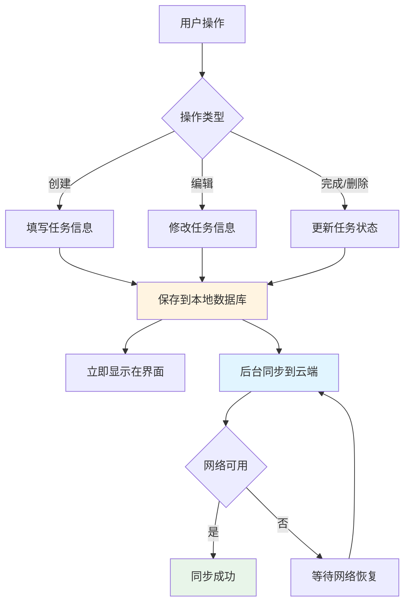

### 1.2 账单管理流程

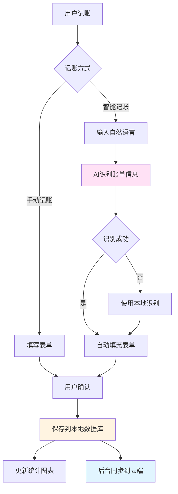

### 1.3 日程管理流程

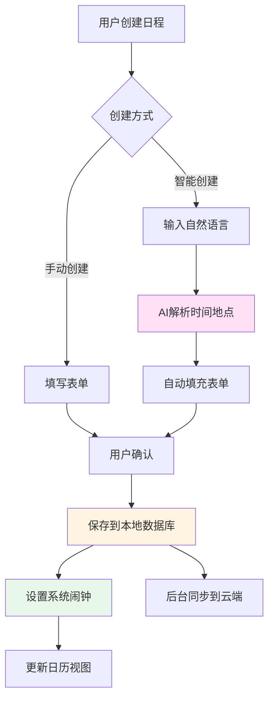

### 1.4 数据同步流程

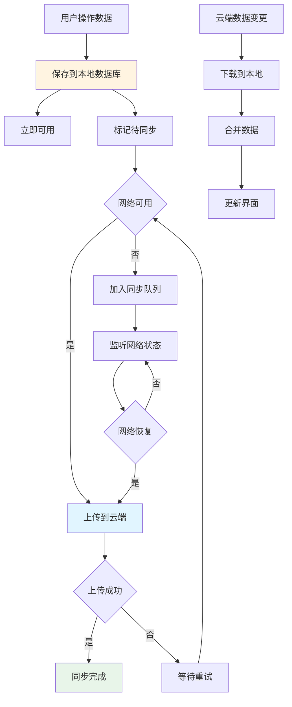

---

## 二、AI功能流程图

### 2.1 智能账单识别流程

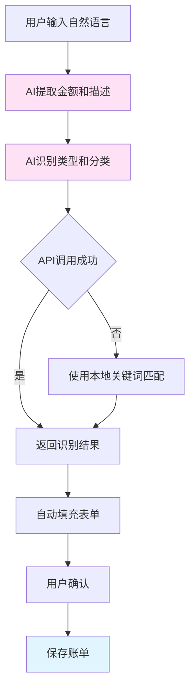

### 2.2 智能创建任务/日程流程

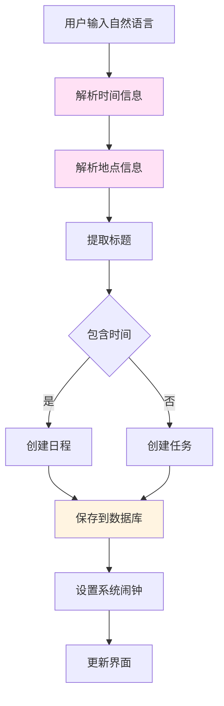

### 2.3 AI对话助手流程

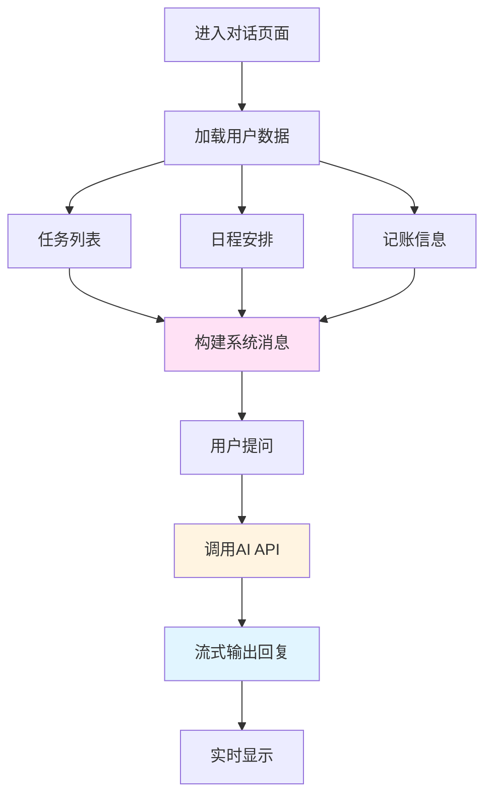

### 2.4 AI服务架构流程

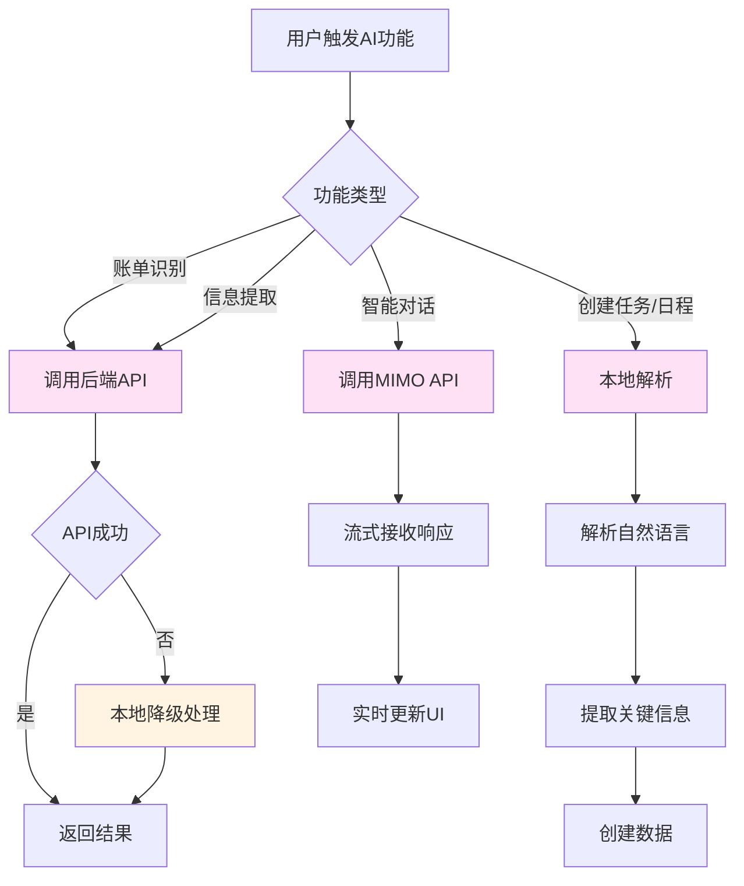

---

## 三、数据流转流程

### 3.1 离线优先策略

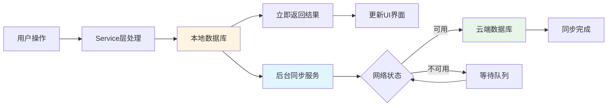

### 3.2 数据生命周期

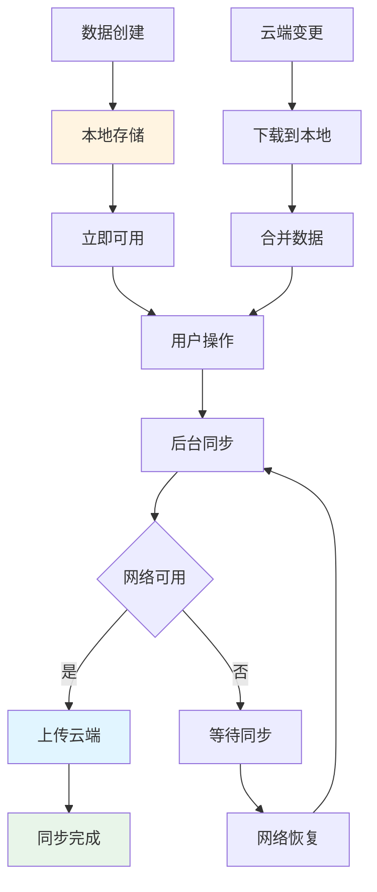

---

## 四、系统集成流程

### 4.1 系统闹钟集成

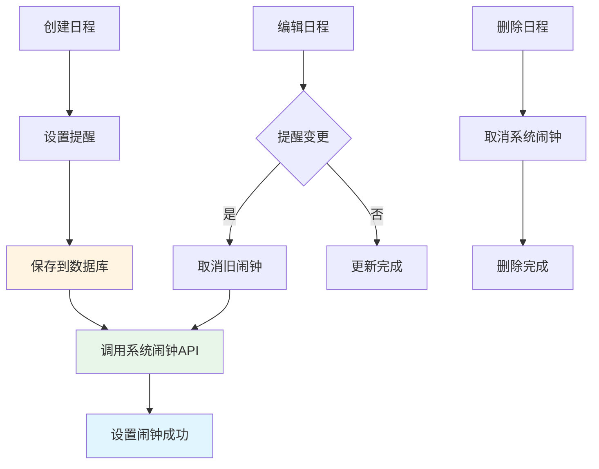

### 4.2 日历数据源切换

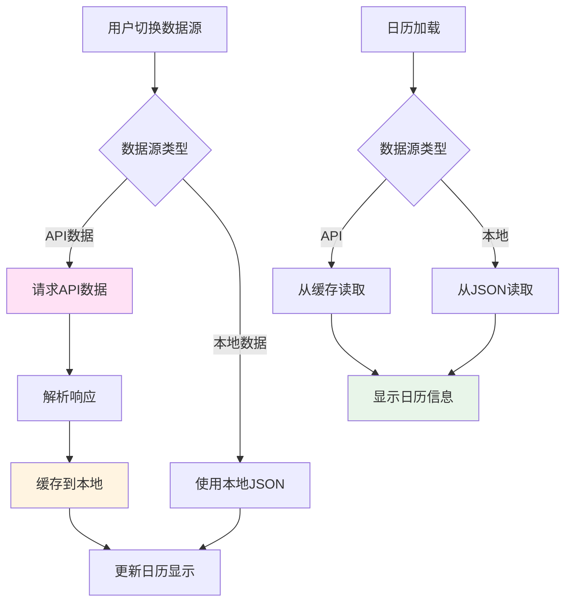

---

## 流程图说明

### 核心特点

1. **离线优先**：所有操作优先保存本地，确保离线可用
2. **后台同步**：数据保存后自动同步，不阻塞用户操作
3. **AI降级**：API失败时自动使用本地识别，保证功能可用
4. **系统集成**：深度集成HarmonyOS系统功能

### 使用建议

- 每个流程图可单独用于PPT页面
- 建议配合文字说明使用
- 可根据需要选择展示的流程图
- 颜色标识：蓝色=服务层，黄色=数据库，绿色=成功状态，粉色=AI功能

---

**文档版本**：v2.0 - PPT简化版  
**最后更新**：2024年12月
