# 辰序 (Chronos) 功能流程图

本文档使用 Mermaid 流程图展示辰序应用的核心功能和 AI 功能的完整流程。

---

## 一、核心功能流程图

### 1.1 任务管理完整流程

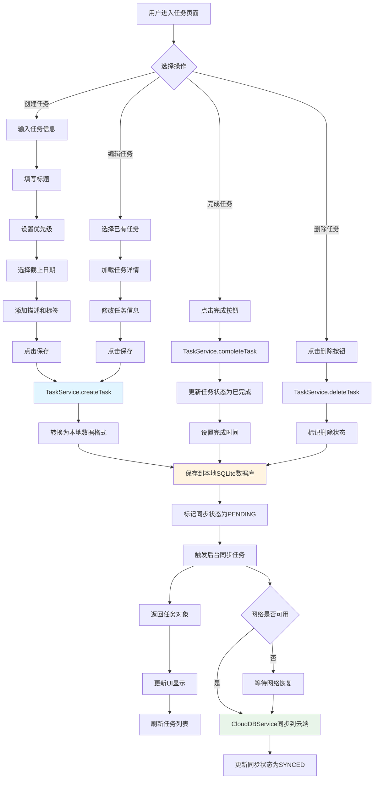

### 1.2 账单管理完整流程

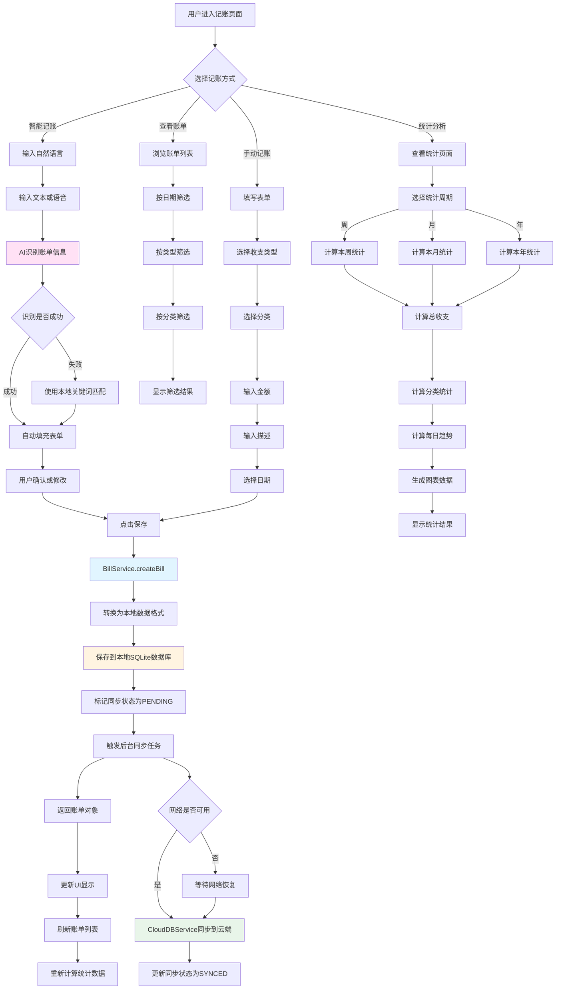

### 1.3 日程管理完整流程

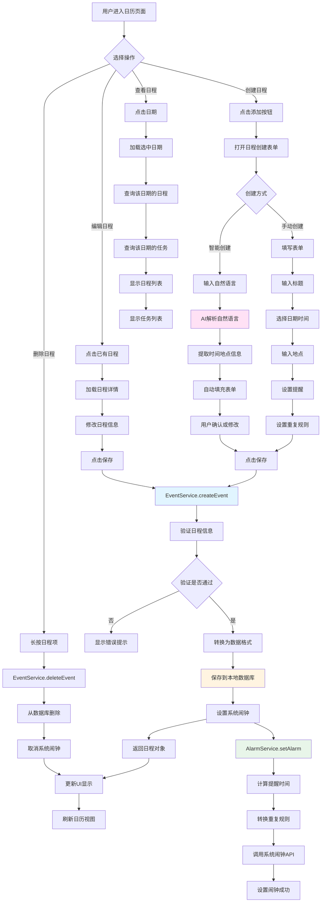

### 1.4 数据同步完整流程

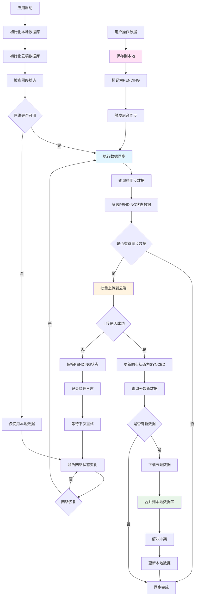

---

## 二、AI功能流程图

### 2.1 智能账单识别完整流程

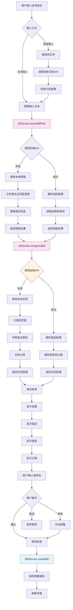

### 2.2 智能创建任务/日程完整流程

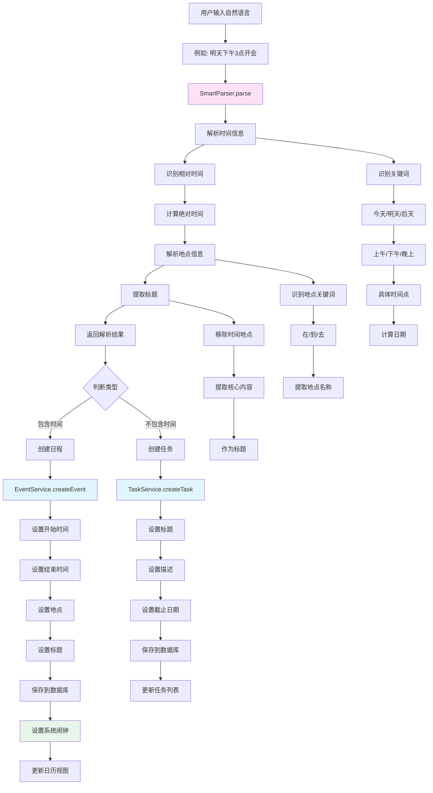

### 2.3 AI对话助手完整流程

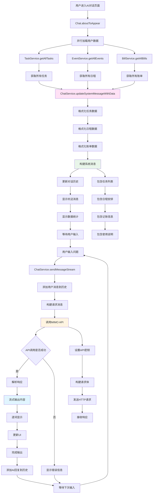

### 2.4 AI服务完整架构流程

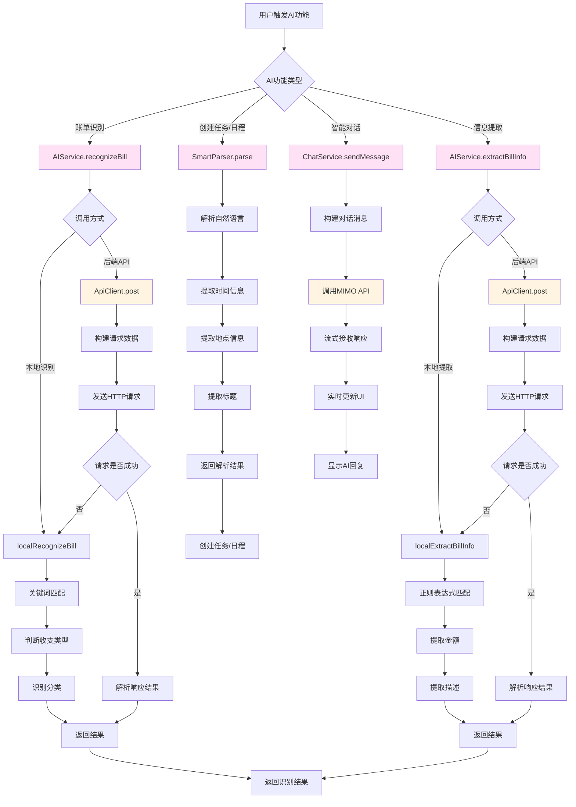

---

## 三、数据流转流程图

### 3.1 离线优先数据流转

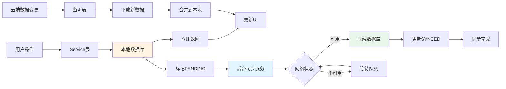

### 3.2 完整数据生命周期

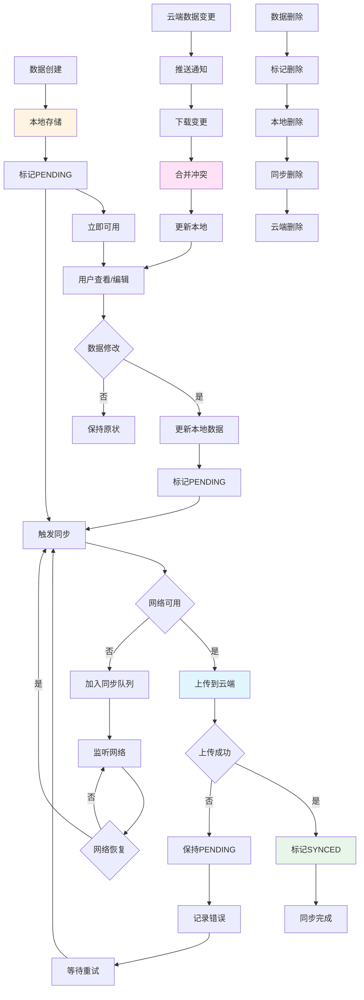

---

## 四、系统集成流程图

### 4.1 系统闹钟集成流程

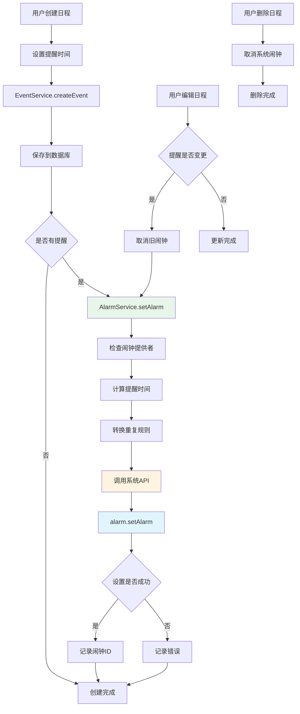

### 4.2 日历数据源切换流程

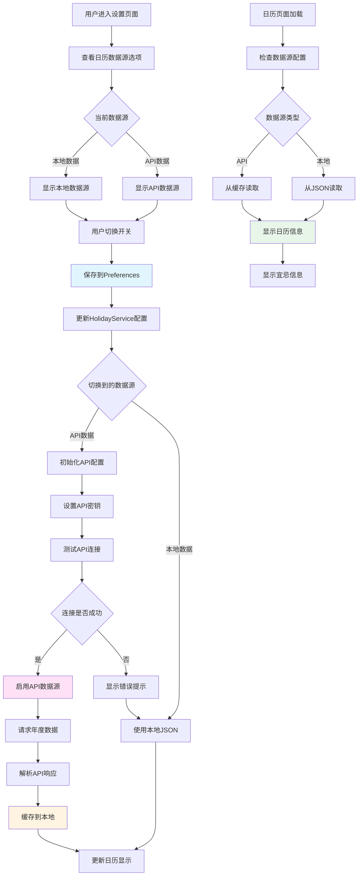

---

## 流程图说明

### 核心功能特点

1. **离线优先策略**：所有数据操作优先保存到本地数据库，确保离线可用
2. **后台静默同步**：数据保存后立即触发后台同步，不阻塞用户操作
3. **冲突解决机制**：云端数据变更时自动合并，解决数据冲突
4. **错误处理机制**：API调用失败时自动降级到本地处理，保证功能可用

### AI功能特点

1. **双重保障**：API调用失败时自动使用本地识别，确保功能可用
2. **智能解析**：自然语言解析支持多种时间表达和地点识别
3. **上下文理解**：AI对话助手加载用户所有数据，提供个性化回答
4. **流式输出**：对话回复采用流式输出，提升用户体验

### 系统集成特点

1. **原生集成**：深度集成HarmonyOS系统功能，如系统闹钟
2. **灵活配置**：支持多种数据源切换，满足不同用户需求
3. **性能优化**：使用缓存机制，减少API调用，提升响应速度

---

**文档版本**：v1.0  
**最后更新**：2024年12月

