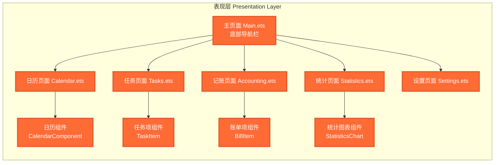
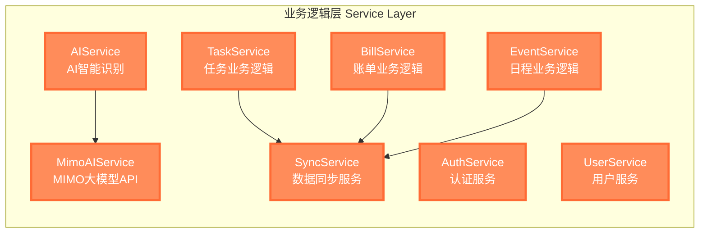
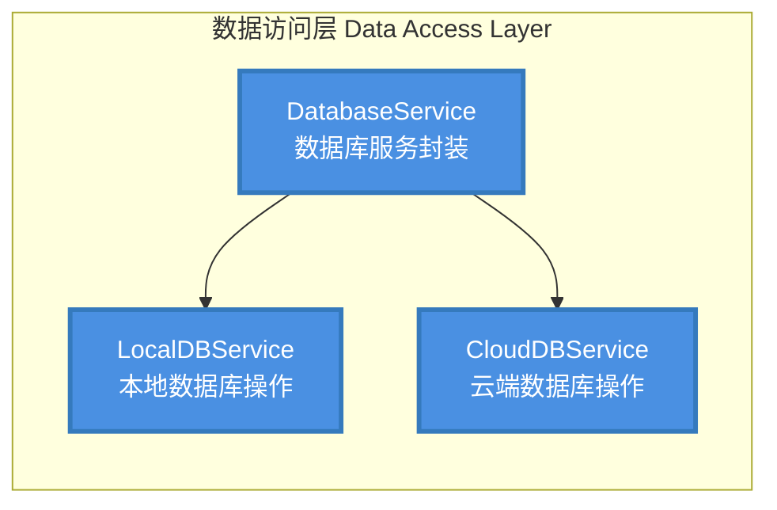
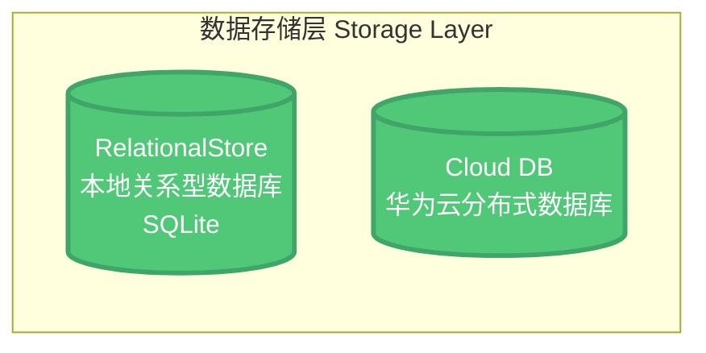
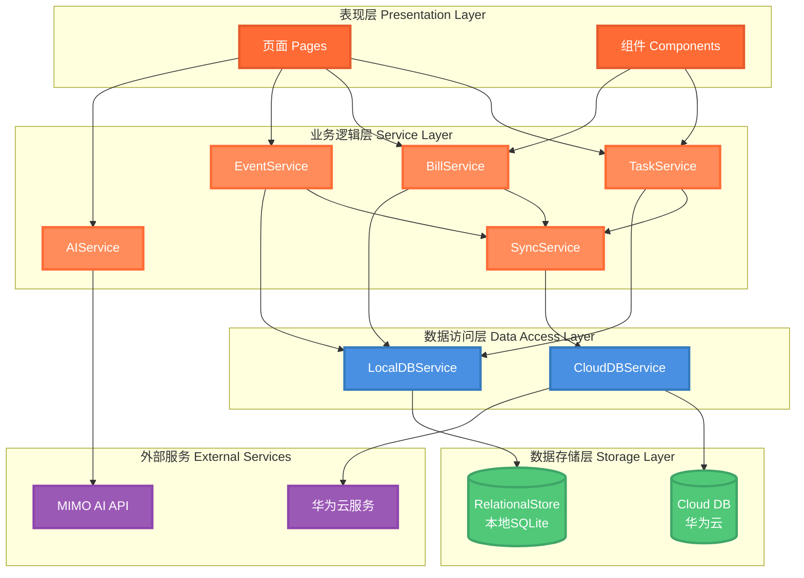

# 辰序 (Chronos) 技术架构图

## 一、表现层 (Presentation Layer)



**技术栈**：ArkUI 声明式UI框架  
**职责**：页面展示、用户交互、UI组件  
**特点**：使用 `@State`、`@Prop`、`@Link` 等装饰器实现响应式数据绑定

---

## 二、业务逻辑层 (Service Layer)



**技术栈**：ArkTS  
**职责**：封装业务逻辑，提供统一的服务接口  
**特点**：单例模式，职责分离，易于测试和维护

---

## 三、数据访问层 (Data Access Layer)



**技术栈**：HarmonyOS Data Kit  
**职责**：数据库CRUD操作，数据同步管理  
**特点**：封装数据库操作细节，提供统一的数据访问接口

---

## 四、数据存储层 (Storage Layer)



**技术栈**：
- RelationalStore（本地关系型数据库）
- Cloud DB（华为云分布式数据库）

**职责**：数据持久化存储  
**特点**：离线优先，双数据库架构，自动同步

---

## 五、层间关系图 (Layer Relationships)



---

## 数据流向说明

### 写入流程（离线优先）
```
用户操作 → 表现层 → 业务逻辑层 → 数据访问层 → 本地数据库（立即返回）
                                                    ↓
                                            后台异步同步 → 云端数据库
```

### 读取流程
```
用户请求 → 表现层 → 业务逻辑层 → 数据访问层 → 本地数据库（优先）
                                                    ↓
                                            需要时同步 → 云端数据库
```

---

## 技术特点

1. **MVVM模式**：视图与业务逻辑分离，数据驱动UI更新
2. **离线优先**：核心功能完全离线可用，数据优先存入本地
3. **双数据库架构**：本地SQLite + 云端Cloud DB，保证数据安全
4. **响应式设计**：使用ArkUI装饰器实现自动UI更新
5. **组件化开发**：可复用组件，代码结构清晰
6. **分层清晰**：职责分离，易于维护和扩展
