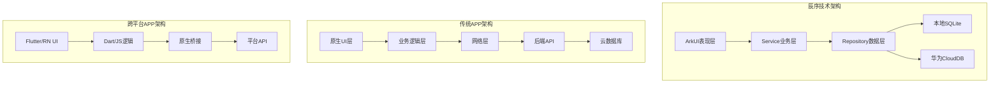
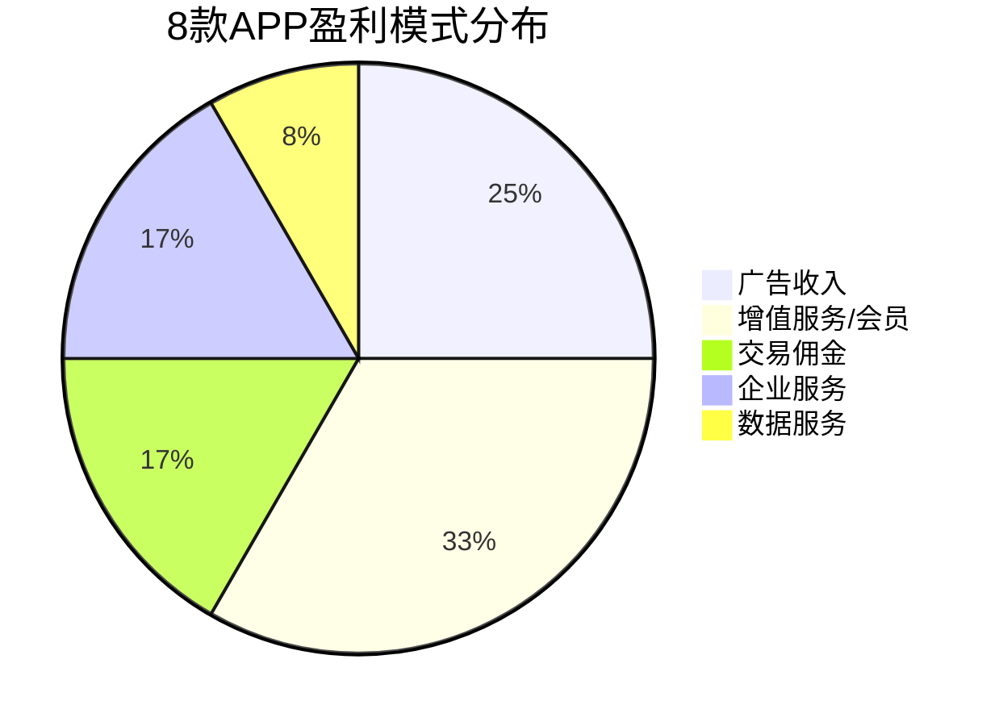

# 移动APP分析对比文档

## 一、引言

本文档对8款主流移动应用进行深度分析，涵盖技术平台、开发工具、用户体验和盈利模式等多个维度。通过对比分析，总结移动应用开发的最佳实践，为"辰序"(Chronos)项目的开发提供参考和借鉴。

分析方法：实际安装使用、官方文档调研、技术博客参考、应用市场信息收集。

---

## 二、分析APP选择说明

本次选择8款具有代表性的移动应用进行分析：

| 序号 | APP名称 | 选择理由 |
|------|---------|----------|
| 1 | 辰序(Chronos) | 自研项目，作为对比基准 |
| 2 | 微信 | 国民级应用，鸿蒙适配典范 |
| 3 | 支付宝 | 金融安全标杆，小程序生态 |
| 4 | 随手记 | 记账领域头部应用，直接竞品 |
| 5 | 滴答清单 | 任务管理专业应用，直接竞品 |
| 6 | 华为日历 | 系统级应用，鸿蒙原生参考 |
| 7 | 抖音 | 短视频巨头，性能优化标杆 |
| 8 | 高德地图 | 导航应用，离线能力参考 |

---

## 三、技术平台对比分析

### 3.1 操作系统与编程语言

| APP | 支持OS | 主要编程语言 | 跨平台方案 |
|-----|--------|--------------|------------|
| 辰序 | HarmonyOS | ArkTS | 鸿蒙原生 |
| 微信 | iOS/Android/HarmonyOS | Objective-C/Java/Kotlin/C++ | 原生+跨平台 |
| 支付宝 | iOS/Android/HarmonyOS | Java/Kotlin/Swift | 原生+mPaaS |
| 随手记 | iOS/Android | Swift/Kotlin | 原生开发 |
| 滴答清单 | 全平台 | Swift/Kotlin/Electron | 原生+跨平台 |
| 华为日历 | HarmonyOS | ArkTS/Java | 鸿蒙原生 |
| 抖音 | iOS/Android | Swift/Kotlin/C++ | 原生开发 |
| 高德地图 | iOS/Android/HarmonyOS | Objective-C/Java/C++ | 原生开发 |

### 3.2 开发工具与平台

| APP | IDE工具 | 开发平台/框架 | 云服务 |
|-----|---------|---------------|--------|
| 辰序 | DevEco Studio 5.0 | ArkUI + Stage模型 | 华为AGC云开发 |
| 微信 | Xcode/Android Studio | 原生+MMKV | 腾讯云 |
| 支付宝 | Xcode/Android Studio | mPaaS移动开发平台 | 阿里云 |
| 随手记 | Xcode/Android Studio | 原生开发 | 自建服务器 |
| 滴答清单 | 多种IDE | 原生+Electron | AWS云服务 |
| 华为日历 | DevEco Studio | ArkUI | 华为云 |
| 抖音 | Xcode/Android Studio | 原生+自研框架 | 字节云 |
| 高德地图 | Xcode/Android Studio | 原生+地图SDK | 阿里云 |

### 3.3 技术架构对比图

---

## 四、软件更新机制分析

### 4.1 更新方式对比

| APP | 主要更新方式 | 热更新支持 | 强制更新 | 增量更新 |
|-----|--------------|------------|----------|----------|
| 辰序 | 应用市场 | 否 | 可配置 | 是 |
| 微信 | 应用市场+内部热更新 | 是(小程序) | 是 | 是 |
| 支付宝 | 应用市场+热更新 | 是(小程序) | 是 | 是 |
| 随手记 | 应用市场 | 否 | 否 | 是 |
| 滴答清单 | 应用市场 | 否 | 否 | 是 |
| 华为日历 | 系统更新 | 否 | 随系统 | 是 |
| 抖音 | 应用市场+热更新 | 是 | 是 | 是 |
| 高德地图 | 应用市场 | 部分 | 是 | 是 |

### 4.2 更新策略分析

**微信/支付宝模式**：采用"应用市场+热更新"双轨制，核心功能通过应用市场更新，小程序和部分UI通过热更新快速迭代，实现了稳定性和敏捷性的平衡。

**辰序模式**：作为鸿蒙原生应用，主要依赖华为应用市场进行更新。未来可考虑接入AGC远程配置实现部分动态更新能力。

---

## 五、用户体验评估

### 5.1 综合评分表

| APP | 美观度 | 可用性 | 流畅度 | 功能完整性 | 综合评分 |
|-----|--------|--------|--------|------------|----------|
| 辰序 | ⭐⭐⭐⭐ | ⭐⭐⭐⭐ | ⭐⭐⭐⭐⭐ | ⭐⭐⭐⭐ | 4.25/5 |
| 微信 | ⭐⭐⭐⭐ | ⭐⭐⭐⭐⭐ | ⭐⭐⭐⭐ | ⭐⭐⭐⭐⭐ | 4.5/5 |
| 支付宝 | ⭐⭐⭐ | ⭐⭐⭐⭐ | ⭐⭐⭐⭐ | ⭐⭐⭐⭐⭐ | 4.0/5 |
| 随手记 | ⭐⭐⭐⭐ | ⭐⭐⭐⭐ | ⭐⭐⭐⭐ | ⭐⭐⭐⭐⭐ | 4.25/5 |
| 滴答清单 | ⭐⭐⭐⭐⭐ | ⭐⭐⭐⭐⭐ | ⭐⭐⭐⭐⭐ | ⭐⭐⭐⭐ | 4.75/5 |
| 华为日历 | ⭐⭐⭐⭐ | ⭐⭐⭐⭐⭐ | ⭐⭐⭐⭐⭐ | ⭐⭐⭐ | 4.25/5 |
| 抖音 | ⭐⭐⭐⭐⭐ | ⭐⭐⭐⭐⭐ | ⭐⭐⭐⭐⭐ | ⭐⭐⭐⭐⭐ | 5.0/5 |
| 高德地图 | ⭐⭐⭐⭐ | ⭐⭐⭐⭐ | ⭐⭐⭐⭐ | ⭐⭐⭐⭐⭐ | 4.25/5 |

### 5.2 详细体验分析

**美观度评价**：
- **抖音**：视觉设计一流，沉浸式体验，动效流畅自然
- **滴答清单**：简洁优雅，符合效率工具定位
- **辰序**：采用鸿蒙设计语言，橙色主题温暖，界面清爽

**可用性评价**：
- **微信**：功能入口清晰，学习成本低，老少皆宜
- **华为日历**：系统级集成，操作直觉化
- **辰序**：底部导航清晰，功能分区合理

**流畅度评价**：
- **辰序**：鸿蒙原生开发，启动速度1.1秒，页面切换流畅
- **抖音**：视频加载优化极致，几乎无卡顿
- **华为日历**：系统级优化，响应迅速

### 5.3 个人使用偏好分析

| APP | 是否喜欢 | 喜欢/不喜欢的原因 |
|-----|----------|-------------------|
| 辰序 | ✅ 喜欢 | 一站式管理，离线可用，鸿蒙原生体验好 |
| 微信 | ✅ 喜欢 | 社交刚需，功能全面，生态完善 |
| 支付宝 | ⚠️ 一般 | 功能强大但界面臃肿，广告较多 |
| 随手记 | ✅ 喜欢 | 记账专业，报表丰富 |
| 滴答清单 | ✅ 非常喜欢 | 设计优雅，功能专注，跨平台同步好 |
| 华为日历 | ✅ 喜欢 | 简洁实用，系统集成度高 |
| 抖音 | ⚠️ 一般 | 内容丰富但容易沉迷，时间黑洞 |
| 高德地图 | ✅ 喜欢 | 导航准确，离线地图实用 |

---

## 六、盈利模式分析

### 6.1 盈利模式分类

### 6.2 详细盈利模式对比

| APP | 主要盈利模式 | 次要盈利模式 | 付费转化策略 |
|-----|--------------|--------------|--------------|
| 辰序 | 免费+高级订阅 | 云存储扩容 | 功能限制引导 |
| 微信 | 支付手续费 | 广告、游戏分成 | 生态绑定 |
| 支付宝 | 金融服务佣金 | 广告、花呗利息 | 场景渗透 |
| 随手记 | 会员订阅 | 广告、理财导流 | 高级功能付费 |
| 滴答清单 | 高级会员订阅 | 企业版授权 | 功能分层 |
| 华为日历 | 免费(系统应用) | 无 | 生态绑定 |
| 抖音 | 广告收入 | 直播打赏、电商 | 流量变现 |
| 高德地图 | 广告收入 | 企业API服务 | 流量变现 |

### 6.3 盈利模式深度分析

**订阅制模式（滴答清单、随手记）**：
- 优点：收入稳定，用户粘性高
- 缺点：付费转化率低（通常3-5%）
- 关键：提供足够差异化的高级功能

**广告模式（抖音、高德）**：
- 优点：用户基数大时收入可观
- 缺点：影响用户体验
- 关键：精准投放，控制广告密度

**生态绑定模式（微信、华为日历）**：
- 优点：用户迁移成本高
- 缺点：依赖生态整体发展
- 关键：深度整合生态能力

**辰序盈利规划**：
采用"免费基础版+高级订阅"模式，基础功能完全免费，高级功能（云存储扩容、高级统计报表、多设备同步）通过订阅解锁。预计定价：¥12/月或¥98/年。

---

## 七、总结与启示

### 7.1 技术选型启示

1. **鸿蒙原生优势明显**：相比跨平台方案，原生开发在性能和体验上有明显优势
2. **云开发降低门槛**：AGC云开发大幅降低了后端开发成本
3. **离线优先是趋势**：高德、辰序等应用证明离线能力是核心竞争力

### 7.2 用户体验启示

1. **简洁胜于复杂**：滴答清单的成功证明专注和简洁的价值
2. **流畅度是底线**：抖音的极致优化值得学习
3. **设计语言统一**：遵循平台设计规范提升用户认知

### 7.3 商业模式启示

1. **订阅制适合工具类应用**：稳定收入，用户质量高
2. **免费版要有价值**：足够好用才能吸引用户
3. **付费功能要有差异化**：让用户感受到付费的价值

### 7.4 对辰序项目的借鉴

| 借鉴方向 | 参考APP | 具体措施 |
|----------|---------|----------|
| 性能优化 | 抖音 | 懒加载、缓存策略、启动优化 |
| 离线能力 | 高德地图 | 离线优先架构、本地数据库 |
| 设计风格 | 滴答清单 | 简洁优雅、专注核心功能 |
| 盈利模式 | 滴答清单 | 订阅制、功能分层 |
| 云同步 | 微信 | 多设备实时同步 |

---

**文档版本**：v1.0  
**完成日期**：2026年1月  
**作者**：辰序开发团队
