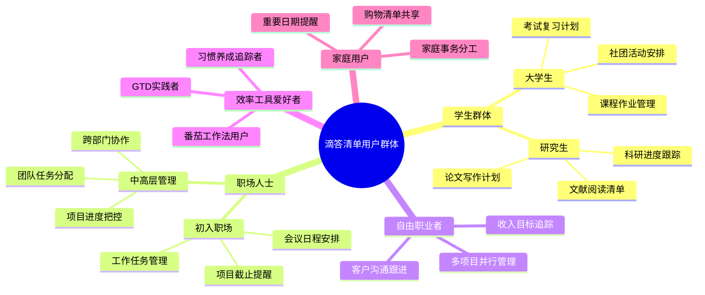
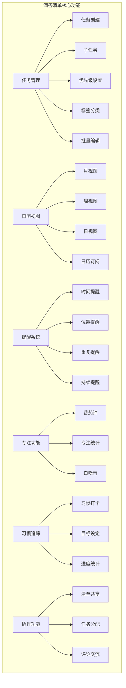
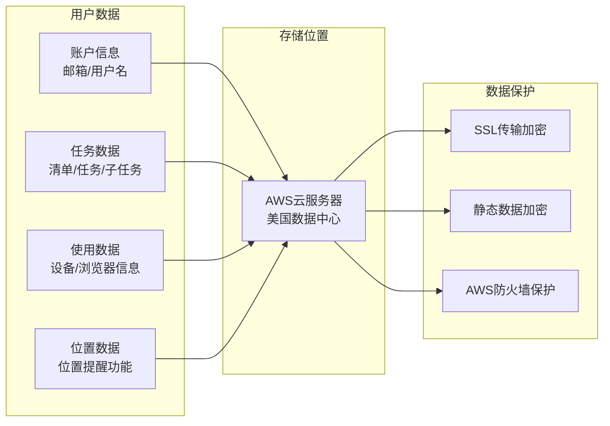
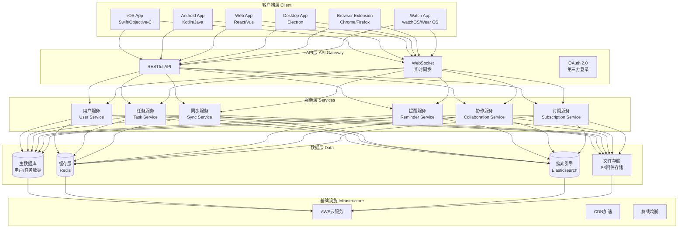
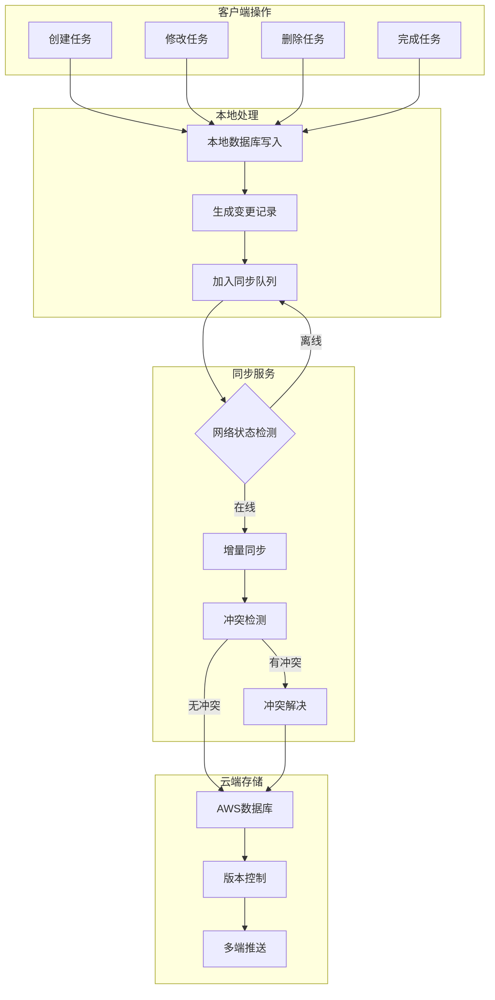
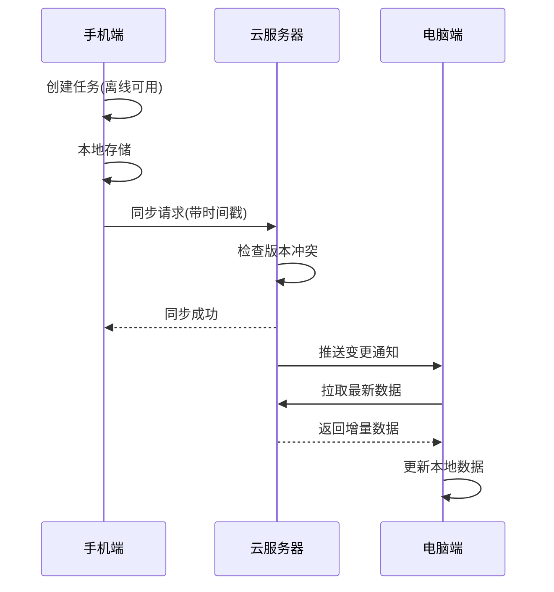
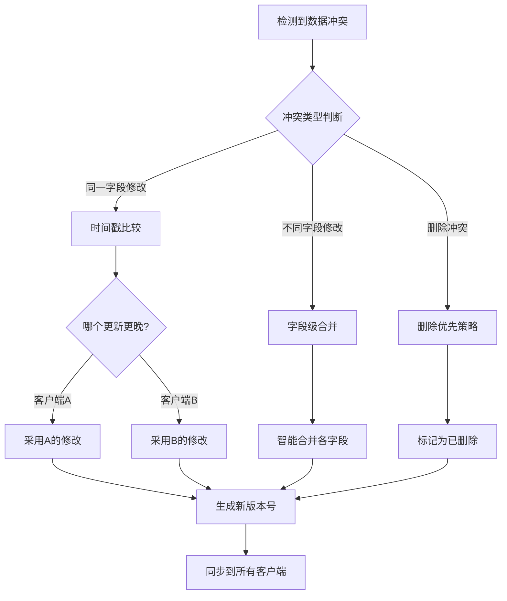
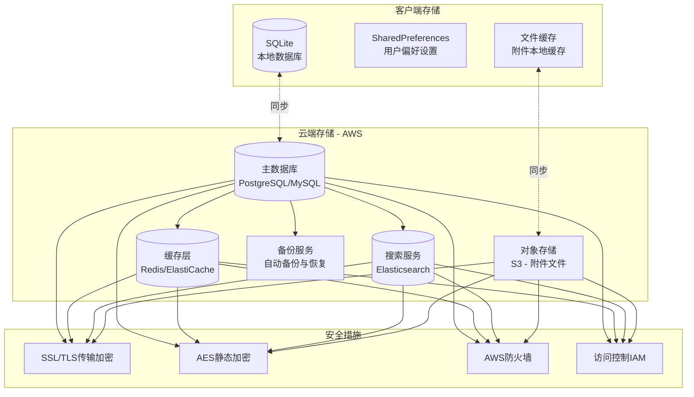
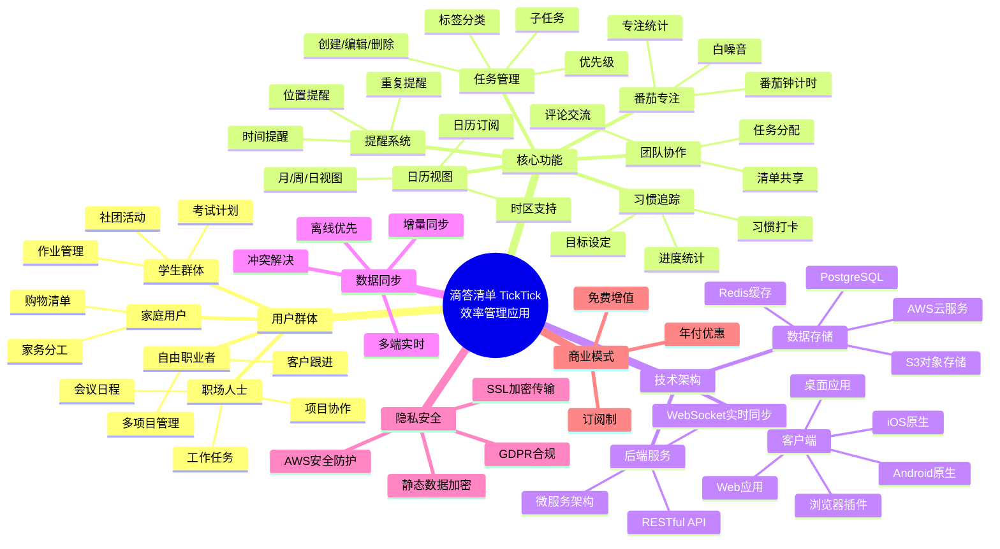

# 移动APP业务分析文档

## 分析对象：滴答清单(TickTick) - 时间管理应用

---

## 一、APP概述

**应用名称**：滴答清单 (TickTick)  
**包名**：com.ticktick.task  
**当前版本**：持续更新中  
**平台**：iOS、Android、Web、Windows、Mac、Linux、浏览器插件、智能手表  
**定位**：全平台任务管理与效率提升工具

滴答清单是一款功能强大的待办事项与任务管理应用，支持跨设备无缝云同步。无论是安排日程、记录备忘、分享购物清单、团队协作，还是培养新习惯、设置生日倒计时，滴答清单都能帮助用户高效完成任务，让生活井井有条。该应用被《纽约时报》旗下Wirecutter评为"最佳待办清单应用"，被The Verge评为"出色"，全球拥有数千万用户。

---

## 二、用户群体分析

### 2.1 目标用户定义

**核心用户群**：追求效率和生活品质的各年龄段用户，具有时间管理意识，需要跨平台同步的任务管理工具。

### 2.2 用户画像



### 2.3 用户特征分析

| 特征维度 | 描述 |
|----------|------|
| **年龄分布** | 18-25岁(35%)、25-40岁(50%)、40岁以上(15%) |
| **设备偏好** | 多设备用户，需要跨平台同步 |
| **使用场景** | 工作办公、学习规划、生活管理、团队协作 |
| **核心诉求** | 高效管理任务、多端同步、智能提醒、团队协作 |
| **付费意愿** | 中等，免费版功能已较完善，高级用户愿意付费解锁更多功能 |

---

## 三、核心功能分析

### 3.1 功能模块概览



### 3.2 功能使用频次分析

| 功能模块 | 日均使用次数 | 单次使用时长 | 使用场景 |
|----------|--------------|--------------|----------|
| 任务添加 | 5-10次 | 10-30秒 | 快速记录待办 |
| 任务查看 | 10-20次 | 30秒-2分钟 | 查看今日任务 |
| 日历视图 | 3-5次 | 1-3分钟 | 规划日程安排 |
| 番茄专注 | 2-4次 | 25-50分钟 | 专注工作学习 |
| 习惯打卡 | 1-5次 | 10-30秒 | 每日习惯记录 |
| 团队协作 | 1-3次 | 2-5分钟 | 任务分配沟通 |

### 3.3 选择滴答清单的原因

1. **全平台覆盖**：支持iOS、Android、Web、桌面端、浏览器插件、智能手表，真正实现无缝同步
2. **智能解析**：自然语言识别，输入"明天下午3点开会"自动解析时间
3. **功能整合**：任务管理+日历+番茄钟+习惯追踪，一站式效率工具
4. **灵活提醒**：支持时间、位置、重复等多种提醒方式
5. **团队协作**：清单共享、任务分配，适合小团队使用
6. **免费版实用**：基础功能免费，满足大部分用户需求

---

## 四、隐私特征分析

### 4.1 权限申请清单

| 权限名称 | 用途说明 | 必要性 |
|----------|----------|--------|
| 网络访问 | 云端数据同步 | 必要 |
| 通知权限 | 任务到期提醒 | 必要 |
| 日历读写 | 与系统日历集成 | 可选 |
| 位置信息 | 位置提醒功能(仅iOS) | 可选 |
| Siri集成 | 语音创建任务(iOS) | 可选 |
| HealthKit | 同步专注时间到Apple健康 | 可选 |
| 麦克风 | 语音输入任务 | 可选 |

### 4.2 数据收集说明



### 4.3 隐私保护措施

- **数据加密**：所有数据传输使用SSL加密，存储数据静态加密
- **AWS托管**：数据库和服务器托管于Amazon Web Services，具备企业级安全防护
- **不出售数据**：明确承诺永不向第三方出售用户个人数据
- **用户数据所有权**：虽然应用代码归公司所有，但用户保留其数据的所有权利
- **数据删除**：用户可随时删除账户，数据将在90天后从备份中清除
- **泄露通知**：发生数据泄露时，72小时内通知用户
- **GDPR合规**：与第三方服务合作时确保符合GDPR要求

---

## 五、主要模块拆解

### 5.1 应用架构图



### 5.2 模块详细说明

#### 5.2.1 任务管理模块

**核心功能**：
- 任务CRUD（创建/读取/更新/删除）
- 子任务支持（最多199个子任务/任务）
- 四级优先级设置
- 标签分类系统
- 批量编辑操作
- 自然语言解析创建任务

**技术特点**：
- 智能NLP解析时间日期
- 支持Markdown格式描述
- 附件上传（普通用户10MB/文件，高级用户20MB/文件）

#### 5.2.2 日历视图模块

**核心功能**：
- 月/周/日三种视图切换
- 网格视图（高级功能）
- 外部日历订阅（Google Calendar等）
- 与系统日历双向同步

**技术特点**：
- 支持iCal标准协议
- 时区自动识别与转换

#### 5.2.3 提醒系统模块

**核心功能**：
- 时间提醒（最多5个提醒/任务）
- 位置提醒（iOS专属）
- 重复提醒（每日/每周/每月/自定义）
- 持续提醒（直到完成）
- 邮件提醒

**技术特点**：
- 推送通知服务（APNs/FCM）
- 地理围栏技术（Geofencing）

#### 5.2.4 番茄专注模块

**核心功能**：
- 番茄钟计时（25分钟工作+5分钟休息）
- 自定义时长
- 专注统计报表
- 白噪音背景音

**技术特点**：
- 后台计时保持
- HealthKit数据同步

#### 5.2.5 习惯追踪模块

**核心功能**：
- 习惯创建与打卡
- 目标设定
- 连续打卡统计
- 进度可视化

#### 5.2.6 协作模块

**核心功能**：
- 清单共享（最多29人/清单）
- 任务分配
- 评论与交流
- 活动日志

---

## 六、核心业务逻辑

### 6.1 数据同步架构



### 6.2 多端同步策略



---

## 七、核心算法与技术难点

### 7.1 技术难点分析

| 难点 | 复杂度 | 解决方案 |
|------|--------|----------|
| 自然语言时间解析 | ⭐⭐⭐⭐ | NLP算法，支持多语言时间表达识别 |
| 多端实时同步 | ⭐⭐⭐⭐⭐ | WebSocket + 增量同步 + 冲突解决策略 |
| 离线数据一致性 | ⭐⭐⭐⭐ | 本地优先 + 版本向量 + 最终一致性 |
| 位置提醒精准度 | ⭐⭐⭐ | 地理围栏 + 低功耗定位 |
| 大规模推送 | ⭐⭐⭐⭐ | APNs/FCM + 消息队列 + 分批推送 |
| 跨平台UI一致性 | ⭐⭐⭐ | 设计系统 + 原生开发 |

### 7.2 自然语言解析算法

```mermaid
flowchart TD
    A[用户输入<br/>"明天下午3点和小王开会"] --> B[NLP解析引擎]
    
    B --> C[时间实体识别]
    C --> C1{匹配时间模式}
    C1 -->|相对时间| C2[明天/后天/下周X]
    C1 -->|绝对时间| C3[X月X日/X号]
    C1 -->|时刻表达| C4[上午/下午X点]
    
    B --> D[任务内容提取]
    D --> D1[移除时间词汇]
    D1 --> D2[提取核心内容<br/>"和小王开会"]
    
    C2 & C3 & C4 --> E[时间标准化]
    E --> F[组合结果]
    D2 --> F
    
    F --> G[返回结构化数据<br/>title: 和小王开会<br/>dueDate: 2026-01-03 15:00]
```

### 7.3 同步冲突解决策略



---

## 八、数据存储架构

### 8.1 存储架构图



### 8.2 核心数据模型

**用户表(users)**：
| 字段 | 类型 | 说明 |
|------|------|------|
| id | UUID | 用户唯一标识 |
| email | VARCHAR | 邮箱地址 |
| username | VARCHAR | 用户名 |
| avatar | VARCHAR | 头像URL |
| timezone | VARCHAR | 时区设置 |
| premium_until | TIMESTAMP | 高级会员到期时间 |
| created_at | TIMESTAMP | 注册时间 |

**任务表(tasks)**：
| 字段 | 类型 | 说明 |
|------|------|------|
| id | UUID | 任务唯一标识 |
| user_id | UUID | 所属用户 |
| list_id | UUID | 所属清单 |
| title | VARCHAR | 任务标题 |
| content | TEXT | 任务描述(Markdown) |
| priority | INTEGER | 优先级(0-3) |
| due_date | TIMESTAMP | 截止时间 |
| reminder | JSONB | 提醒设置 |
| repeat_rule | VARCHAR | 重复规则(iCal格式) |
| tags | ARRAY | 标签列表 |
| status | INTEGER | 状态(0待办/1完成) |
| sort_order | BIGINT | 排序权重 |
| version | INTEGER | 版本号(同步用) |
| updated_at | TIMESTAMP | 更新时间 |

**清单表(lists)**：
| 字段 | 类型 | 说明 |
|------|------|------|
| id | UUID | 清单唯一标识 |
| user_id | UUID | 所有者 |
| name | VARCHAR | 清单名称 |
| color | VARCHAR | 颜色标识 |
| is_shared | BOOLEAN | 是否共享 |
| sort_order | INTEGER | 排序权重 |

### 8.3 第三方服务集成

| 服务 | 用途 | 集成方式 |
|-----|------|----------|
| AWS | 云基础设施 | 数据库/存储/计算 |
| Google Calendar | 日历同步 | OAuth + CalDAV |
| Apple Calendar | 日历同步 | CalDAV协议 |
| Outlook | 日历/邮件集成 | Microsoft Graph API |
| Zapier | 自动化工作流 | Webhook |
| IFTTT | 自动化触发 | API集成 |
| Siri | 语音创建任务 | SiriKit |
| Google Assistant | 语音助手 | Actions on Google |

---

## 九、商业模式分析

### 9.1 定价策略

| 版本 | 价格 | 主要功能 |
|------|------|----------|
| 免费版 | $0 | 基础任务管理、日历视图、提醒、番茄钟 |
| 高级版(月付) | $2.99/月 | 全部功能解锁 |
| 高级版(年付) | $35.99/年 | 全部功能，约$3/月 |

### 9.2 高级版专属功能

- 299个清单（免费版9个）
- 每清单999个任务（免费版99个）
- 每任务199个子任务
- 每任务5个提醒
- 清单共享最多29人
- 每日99个附件上传
- 日历订阅
- 网格视图
- 自定义智能清单
- 更多习惯追踪
- 更多倒计时

---

## 十、思维导图总览



---

**文档版本**：v1.0  
**分析日期**：2026年1月  
**数据来源**：[TickTick官网](https://ticktick.com)、App Store、Google Play、官方隐私政策

