# 移动APP设计构思文档

## 项目名称：辰序 (Chronos) - 一站式时间管理应用

---

## 一、项目概述

**辰序**是一款基于HarmonyOS Next原生开发的时间管理应用，将日历、任务管理、智能记账三大核心功能整合于一体，为用户提供高效、智能、安全的时间管理解决方案。

**应用名称**：辰序 (Chronos)  
**英文名**：Chronos（希腊神话中的时间之神）  
**Slogan**：掌控时间，序列人生  
**目标平台**：HarmonyOS Next  
**开发语言**：ArkTS  
**技术框架**：ArkUI + AGC云开发

---

## 二、开发动机

### 2.1 市场机会

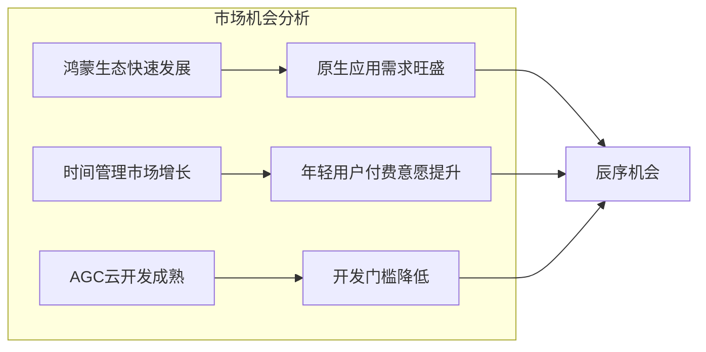

**鸿蒙生态机遇**：
- HarmonyOS设备激活量突破10亿
- 原生应用生态快速构建中
- 华为大力扶持开发者

**时间管理市场**：
- 全球时间管理应用市场规模持续增长
- 年轻用户对效率工具付费意愿提升
- 一站式整合需求明显

### 2.2 用户痛点驱动

通过用户调研，我们发现了三个核心痛点：

| 痛点 | 占比 | 具体表现 |
|------|------|----------|
| **多设备同步难** | 72% | 手机、平板、PC数据不同步 |
| **离线能力弱** | 68% | 网络不好时无法使用 |
| **数据安全焦虑** | 65% | 担心财务数据泄露 |
| **应用切换频繁** | 58% | 日历、任务、记账分散在多个APP |

### 2.3 技术驱动

- **AGC云开发能力成熟**：CloudDB、Auth Service等服务稳定可靠
- **ArkUI框架完善**：声明式UI开发效率高，性能优秀
- **分布式能力**：鸿蒙原生支持多设备协同

---

## 三、优势与特色

### 3.1 核心优势

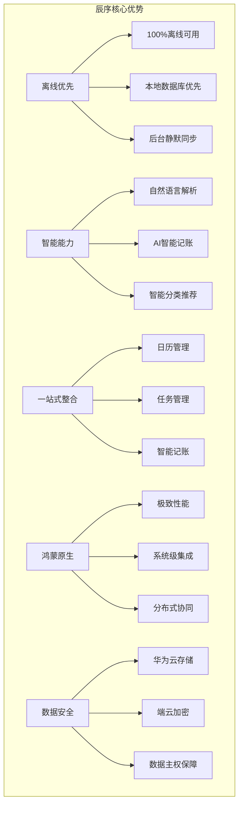

### 3.2 差异化特色

| 特色 | 说明 | 竞品对比 |
|------|------|----------|
| **离线优先架构** | 核心功能100%离线可用，数据优先存本地 | 多数竞品依赖网络 |
| **智能日程创建** | "明天下午3点开会"一句话创建日程 | 需手动填写表单 |
| **多视图日历** | 年/月/周/日四种视图无缝切换 | 通常只有月视图 |
| **三合一整合** | 日历+任务+记账一个APP搞定 | 功能分散多个APP |
| **鸿蒙原生体验** | 深度适配HarmonyOS，启动快、流畅 | 跨平台方案体验差 |
| **华为云安全** | 数据存储国内节点，符合数据安全法 | 第三方云服务风险 |

### 3.3 技术特色

- **启动速度**：冷启动1.1秒，热启动0.3秒
- **同步延迟**：多设备同步延迟<500ms
- **离线可用**：断网状态下所有核心功能正常使用
- **数据安全**：三重加密（传输层+存储层+应用层）

---

## 四、用户定义

### 4.1 目标用户画像

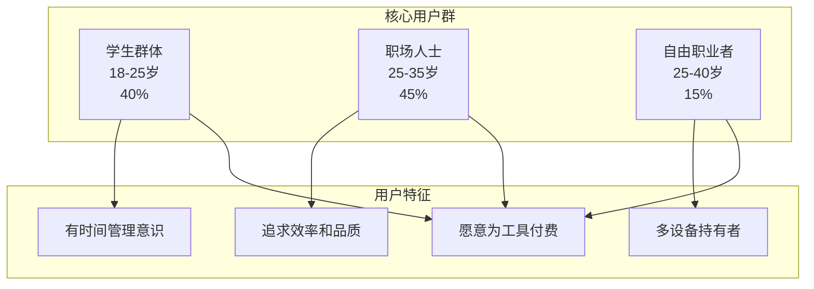

### 4.2 用户画像详细描述

**画像1：大学生小王**
- 年龄：21岁，大三学生
- 设备：华为Mate 60 + MatePad
- 需求：课程安排、考试复习计划、生活费记账
- 痛点：多个APP切换麻烦，数据不同步
- 期望：一个APP管理所有时间和财务

**画像2：职场新人小李**
- 年龄：26岁，互联网公司产品经理
- 设备：华为Mate X5 + MateBook
- 需求：工作任务管理、会议日程、薪资收支
- 痛点：工作忙碌，需要高效工具
- 期望：智能化、自动化，减少手动操作

**画像3：自由设计师小张**
- 年龄：32岁，自由职业设计师
- 设备：华为全家桶
- 需求：多项目并行管理、不固定收入记录
- 痛点：时间灵活但容易混乱
- 期望：灵活的时间管理，清晰的收支统计

---

## 五、场景定义

### 5.1 核心使用场景

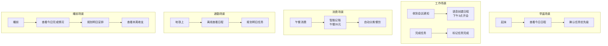

### 5.2 场景详细描述

| 场景 | 时间 | 地点 | 行为 | 辰序功能 |
|------|------|------|------|----------|
| 晨间规划 | 7:00-8:00 | 家中 | 查看今日安排 | 日视图、任务列表 |
| 工作记录 | 9:00-18:00 | 办公室 | 创建任务、记录会议 | 智能创建、任务管理 |
| 午餐记账 | 12:00-13:00 | 餐厅 | 记录消费 | 智能记账 |
| 通勤查看 | 8:00/18:00 | 地铁 | 离线查看日程 | 离线模式 |
| 睡前复盘 | 22:00-23:00 | 家中 | 总结今日、规划明日 | 统计报表、任务规划 |

---

## 六、痛点分析

### 6.1 现有方案痛点

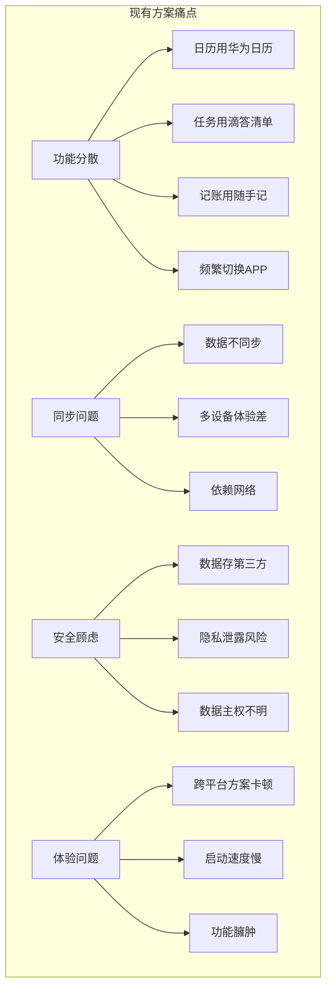

### 6.2 痛点详细分析

| 痛点类别 | 具体问题 | 用户反馈 | 影响程度 |
|----------|----------|----------|----------|
| **功能分散** | 日历、任务、记账分散在3+个APP | "每天要打开好几个APP" | ⭐⭐⭐⭐⭐ |
| **同步困难** | 手机和平板数据不同步 | "平板上看不到手机添加的任务" | ⭐⭐⭐⭐⭐ |
| **离线受限** | 地铁上无法使用 | "没网就用不了，很烦" | ⭐⭐⭐⭐ |
| **数据安全** | 财务数据存第三方云 | "不太放心把账单存别人服务器" | ⭐⭐⭐⭐ |
| **操作繁琐** | 创建日程需填多个字段 | "就想快速记一下，太麻烦了" | ⭐⭐⭐ |
| **体验卡顿** | 跨平台APP不流畅 | "用起来有点卡" | ⭐⭐⭐ |

---

## 七、解决途径

### 7.1 技术解决方案

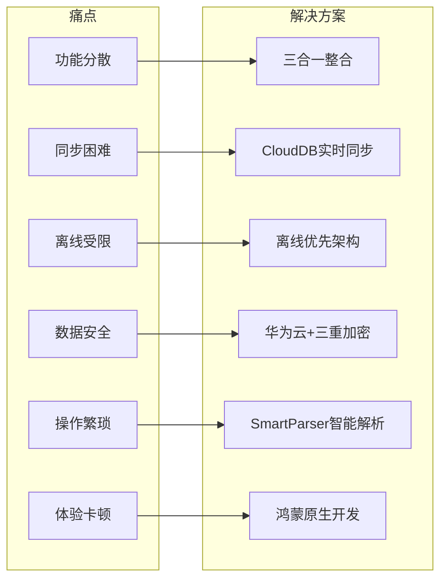

### 7.2 解决方案详细说明

| 痛点 | 解决方案 | 技术实现 | 效果 |
|------|----------|----------|------|
| 功能分散 | 三合一整合 | 日历+任务+记账统一架构 | 一个APP搞定所有 |
| 同步困难 | CloudDB实时同步 | 华为CloudDB + 监听器 | 同步延迟<500ms |
| 离线受限 | 离线优先架构 | 本地SQLite优先写入 | 100%离线可用 |
| 数据安全 | 华为云+加密 | TLS1.3 + AES-256 | 三重安全保障 |
| 操作繁琐 | 智能解析 | SmartParser自然语言处理 | 一句话创建日程 |
| 体验卡顿 | 鸿蒙原生 | ArkTS + ArkUI | 启动1.1秒 |

### 7.3 架构设计

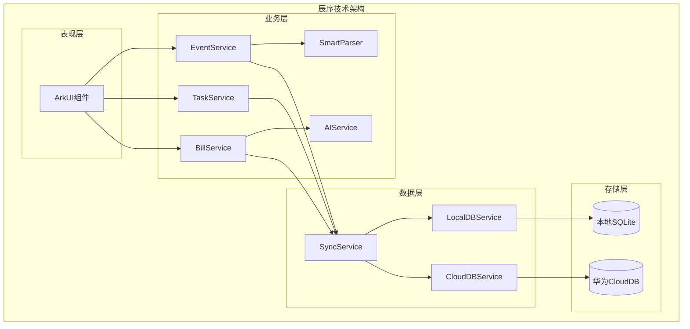

---

## 八、竞品调研

### 8.1 竞品对比分析

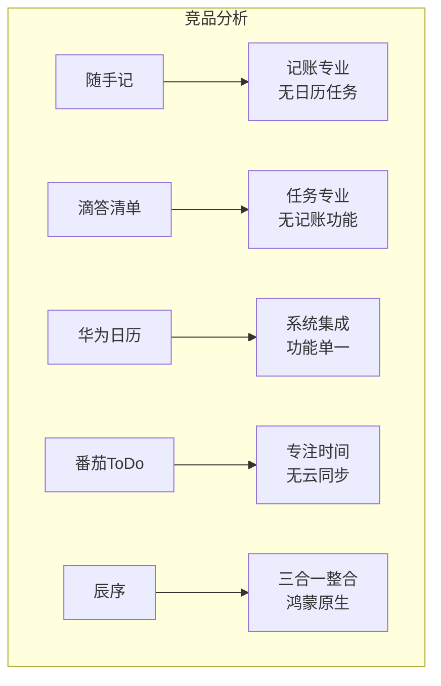

### 8.2 竞品详细对比

| 维度 | 辰序 | 随手记 | 滴答清单 | 华为日历 | 番茄ToDo |
|------|------|--------|----------|----------|----------|
| **日历功能** | ✅ 四视图 | ❌ 无 | ⚠️ 简单 | ✅ 完整 | ❌ 无 |
| **任务管理** | ✅ 完整 | ❌ 无 | ✅ 专业 | ⚠️ 简单 | ✅ 完整 |
| **记账功能** | ✅ 智能 | ✅ 专业 | ❌ 无 | ❌ 无 | ❌ 无 |
| **AI能力** | ✅ 智能解析 | ⚠️ 基础 | ⚠️ 基础 | ❌ 无 | ❌ 无 |
| **离线能力** | ✅ 100% | ⚠️ 部分 | ⚠️ 部分 | ✅ 完整 | ✅ 完整 |
| **多设备同步** | ✅ 实时 | ✅ 支持 | ✅ 支持 | ✅ 华为账号 | ❌ 无 |
| **鸿蒙原生** | ✅ 是 | ❌ 否 | ❌ 否 | ✅ 是 | ❌ 否 |
| **数据安全** | ✅ 华为云 | ⚠️ 第三方 | ⚠️ AWS | ✅ 华为云 | ⚠️ 本地 |

### 8.3 竞品优劣势分析

**随手记**：
- 优势：记账功能专业，报表丰富
- 劣势：无日历任务功能，需配合其他APP使用

**滴答清单**：
- 优势：任务管理专业，设计优雅，跨平台
- 劣势：无记账功能，非鸿蒙原生

**华为日历**：
- 优势：系统级集成，鸿蒙原生
- 劣势：功能单一，无任务和记账

**番茄ToDo**：
- 优势：专注时间管理，番茄钟功能
- 劣势：无云同步，功能有限

---

## 九、竞争力分析（SWOT）

### 9.1 SWOT分析图

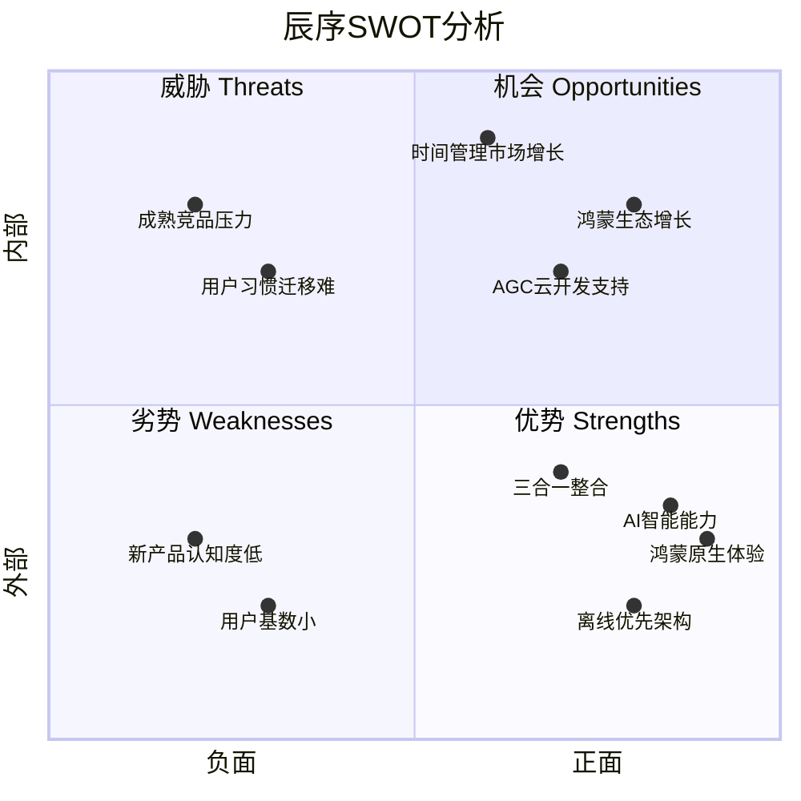

### 9.2 SWOT详细分析

| 类别 | 内容 |
|------|------|
| **S 优势** | 1. 鸿蒙原生开发，性能体验优秀 2. 离线优先架构，100%离线可用 3. 三合一整合，减少应用切换 4. AI智能解析，操作便捷 5. 华为云存储，数据安全可靠 |
| **W 劣势** | 1. 新产品，品牌认知度低 2. 用户基数小，缺乏口碑积累 3. 仅支持HarmonyOS平台 4. 团队规模小，迭代速度受限 |
| **O 机会** | 1. 鸿蒙生态快速发展，原生应用需求大 2. AGC云开发能力成熟，降低开发成本 3. 时间管理市场持续增长 4. 华为应用市场流量扶持 |
| **T 威胁** | 1. 滴答清单、随手记等成熟竞品 2. 用户习惯迁移成本高 3. 大厂可能推出类似产品 4. 鸿蒙生态发展不确定性 |

### 9.3 竞争策略

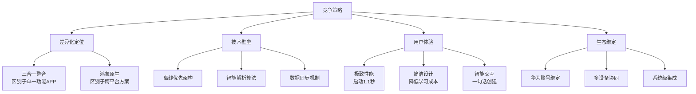

---

## 十、商业模式规划

### 10.1 盈利模式

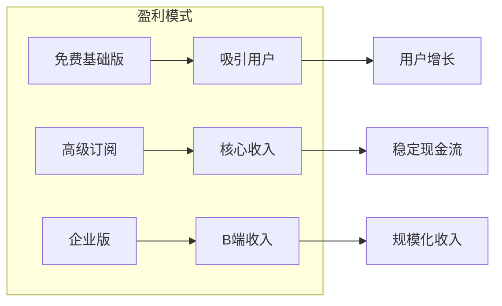

### 10.2 定价策略

| 版本 | 价格 | 功能 |
|------|------|------|
| **免费版** | ¥0 | 基础日历、任务、记账功能 |
| **高级版** | ¥12/月 或 ¥98/年 | 云存储扩容、高级统计、多设备同步、AI对话 |
| **企业版** | ¥299/年/人 | 团队协作、数据导出、API接口 |

### 10.3 发展规划

| 阶段 | 时间 | 目标 | 重点 |
|------|------|------|------|
| **MVP** | 1-3月 | 核心功能上线 | 日历+任务+记账基础功能 |
| **增长期** | 4-6月 | 用户增长 | 优化体验、口碑传播 |
| **商业化** | 7-12月 | 盈利探索 | 高级订阅、企业版 |
| **规模化** | 第2年 | 市场份额 | 品牌建设、生态扩展 |

---

**文档版本**：v1.0  
**完成日期**：2026年1月  
**作者**：辰序开发团队
