# 辰序 (Chronos) App UI Flow 与移动设计八要素分析

## 一、应用概述

**辰序 (Chronos)** 是一款基于 HarmonyOS Next 开发的智能时间管理应用，集成日历、任务管理、智能记账三大核心功能，采用 AI 赋能的方式提升用户效率。本文档将从移动设计八要素角度深入分析该应用的设计思路，并绘制完整的 UI Flow。

---

## 二、移动设计八要素分析

### 2.1 用户定位

#### 目标用户画像

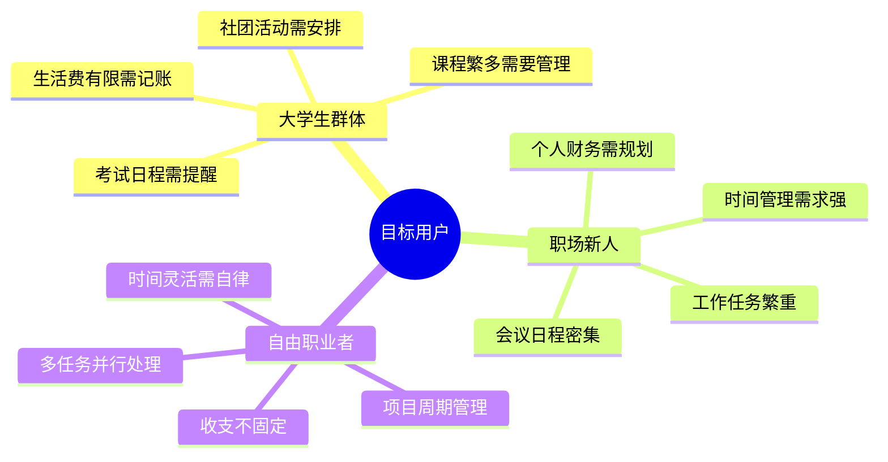

#### 用户特征分析

| 维度 | 特征描述 |
|------|----------|
| 年龄层 | 18-35岁，数字原住民 |
| 技术素养 | 熟悉智能手机操作，接受新技术 |
| 使用场景 | 碎片化时间、移动办公、随时记录 |
| 核心诉求 | 高效管理时间、清晰掌握财务、减少遗忘 |
| 痛点 | 多应用切换繁琐、数据分散、缺乏智能提醒 |

#### 用户行为特点

1. **高频使用**：每日多次打开查看日程和任务
2. **碎片化操作**：利用零散时间快速记录
3. **跨设备需求**：希望数据在多设备间同步
4. **个性化偏好**：期望应用能学习使用习惯


---

### 2.2 产品定位

#### 产品定位矩阵

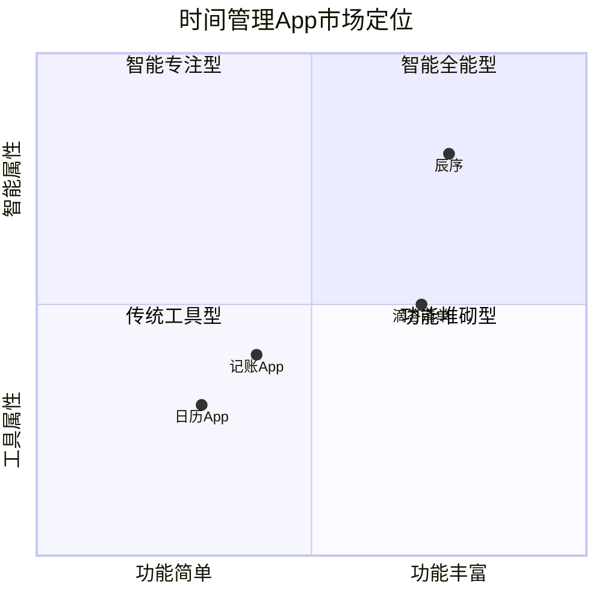

#### 产品核心价值

| 价值维度 | 具体体现 |
|----------|----------|
| 一站式服务 | 日历+任务+记账三合一，减少应用切换 |
| AI赋能 | 智能识别账单、自然语言创建日程、AI对话助手 |
| 离线优先 | 无网络环境下完全可用，数据安全可靠 |
| 原生体验 | 深度适配HarmonyOS，系统级闹钟集成 |
| 数据同步 | 华为云数据库支持，多设备无缝切换 |

#### 差异化竞争策略

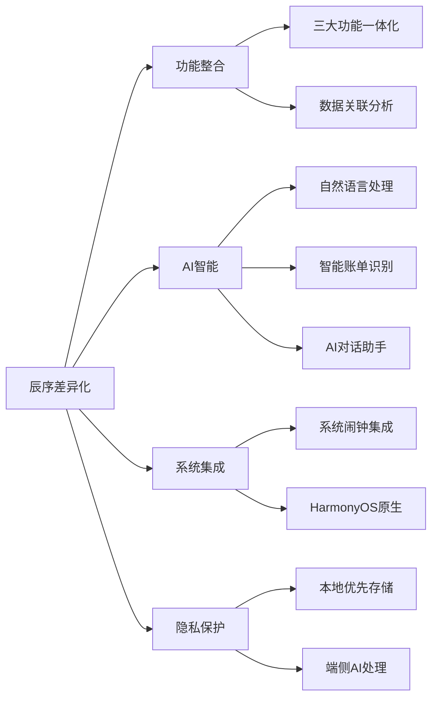


---

### 2.3 需求定位

#### 需求层次分析

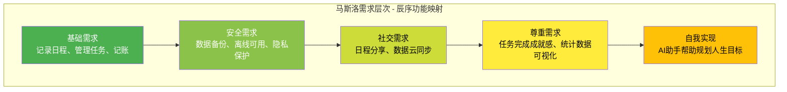

#### 核心需求清单

| 需求类型 | 具体需求 | 优先级 | 实现状态 |
|----------|----------|--------|----------|
| 基础功能 | 日历查看与日程管理 | P0 | ✅ 已实现 |
| 基础功能 | 任务创建与管理 | P0 | ✅ 已实现 |
| 基础功能 | 收支记账 | P0 | ✅ 已实现 |
| 智能功能 | AI账单识别 | P1 | ✅ 已实现 |
| 智能功能 | 自然语言创建日程 | P1 | ✅ 已实现 |
| 智能功能 | AI对话助手 | P1 | ✅ 已实现 |
| 数据功能 | 本地数据存储 | P0 | ✅ 已实现 |
| 数据功能 | 云端数据同步 | P1 | ✅ 已实现 |
| 系统集成 | 系统闹钟提醒 | P1 | ✅ 已实现 |
| 统计分析 | 账单统计图表 | P2 | ✅ 已实现 |

#### 需求优先级决策流程

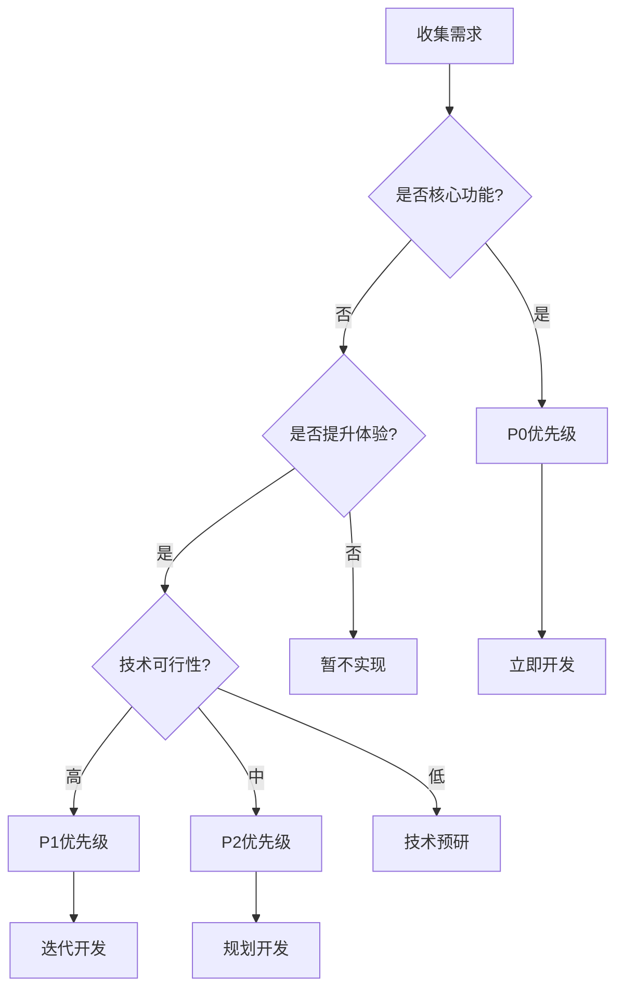


---

### 2.4 时机选择

#### 市场时机分析

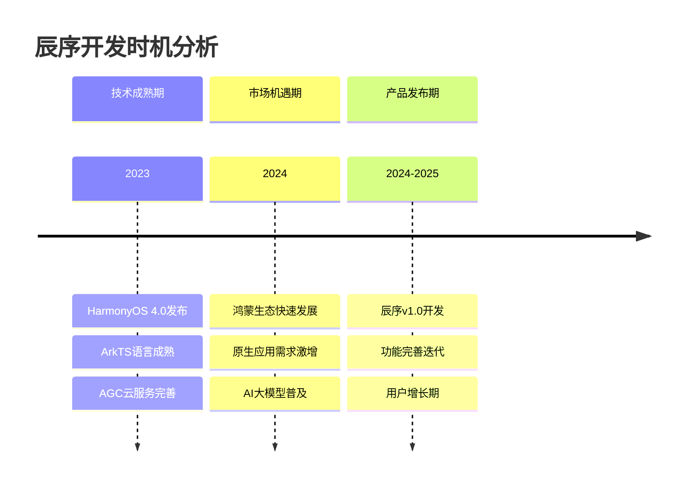

#### 时机选择的关键因素

| 因素 | 分析 | 结论 |
|------|------|------|
| 技术成熟度 | HarmonyOS Next生态完善，开发工具链成熟 | ✅ 时机成熟 |
| 市场需求 | 用户对一站式时间管理工具需求强烈 | ✅ 需求明确 |
| 竞争格局 | 鸿蒙原生时间管理应用较少 | ✅ 蓝海市场 |
| 政策支持 | 国产操作系统发展受政策鼓励 | ✅ 政策利好 |
| AI技术 | 大模型API成本降低，能力提升 | ✅ 技术赋能 |

#### 进入市场的窗口期

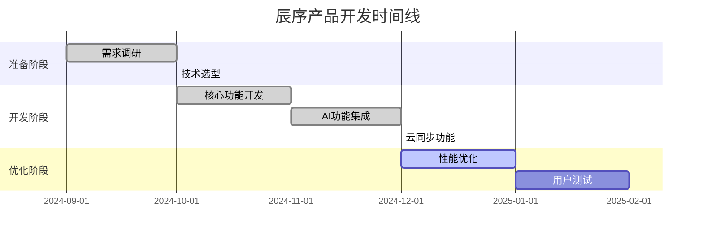


---

### 2.5 产品打磨

#### 产品迭代策略

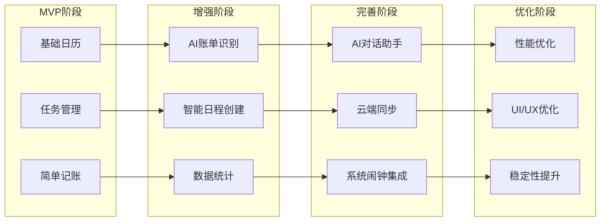

#### 用户体验优化点

| 优化维度 | 具体措施 | 效果 |
|----------|----------|------|
| 响应速度 | 离线优先架构，本地数据库优先响应 | 操作即时反馈 |
| 操作便捷 | 自然语言输入，减少表单填写 | 降低使用门槛 |
| 视觉设计 | 简洁现代的UI，符合HarmonyOS设计规范 | 视觉舒适 |
| 智能提示 | AI识别自动填充，减少手动输入 | 提升效率 |
| 数据安全 | 本地存储+云端备份双保险 | 用户安心 |

#### 质量保证措施

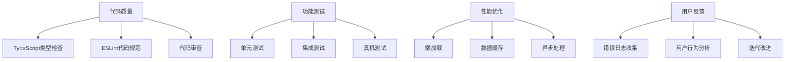


---

### 2.6 风险处置

#### 风险识别与应对

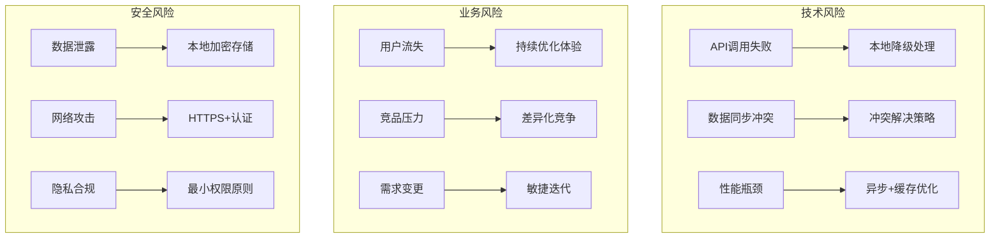

#### 风险等级评估

| 风险类型 | 风险描述 | 发生概率 | 影响程度 | 应对策略 |
|----------|----------|----------|----------|----------|
| 技术风险 | AI API不可用 | 中 | 高 | 本地识别降级方案 |
| 技术风险 | 云数据库故障 | 低 | 高 | 离线优先+本地存储 |
| 业务风险 | 用户增长缓慢 | 中 | 中 | 优化推广策略 |
| 安全风险 | 数据安全问题 | 低 | 高 | 加密+权限控制 |
| 合规风险 | 隐私政策变更 | 低 | 中 | 持续关注法规 |

#### 容错机制设计

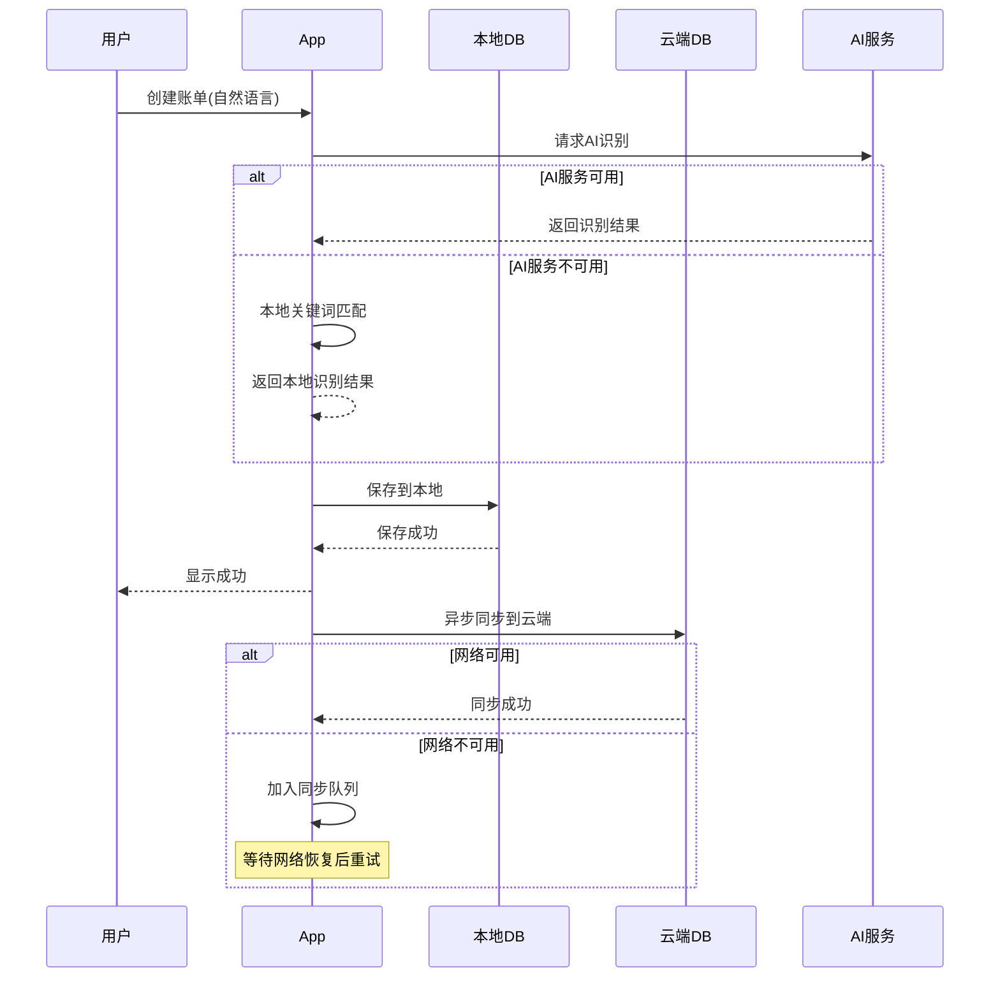


---

### 2.7 团队协作

#### 开发团队结构

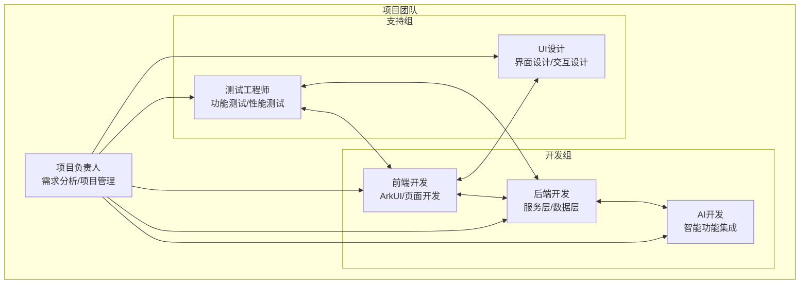

#### 协作工具与流程

| 协作维度 | 工具/方法 | 用途 |
|----------|-----------|------|
| 代码管理 | Git + GitHub | 版本控制、代码审查 |
| 项目管理 | 看板/任务列表 | 任务分配、进度跟踪 |
| 文档协作 | Markdown文档 | 需求文档、技术文档 |
| 沟通协调 | 即时通讯 | 日常沟通、问题讨论 |
| 设计协作 | 设计稿共享 | UI设计、原型评审 |

#### 敏捷开发流程

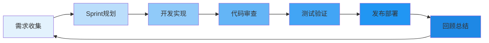


---

### 2.8 商业模式

#### 商业模式画布

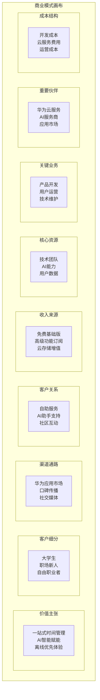

#### 盈利模式设计

| 模式 | 描述 | 目标用户 |
|------|------|----------|
| 免费增值 | 基础功能免费，高级功能付费 | 全部用户 |
| 订阅制 | 月度/年度会员，解锁全部功能 | 重度用户 |
| 云存储 | 免费额度+付费扩容 | 数据量大的用户 |
| 企业版 | 团队协作功能，按席位收费 | 企业用户 |

#### 用户增长策略

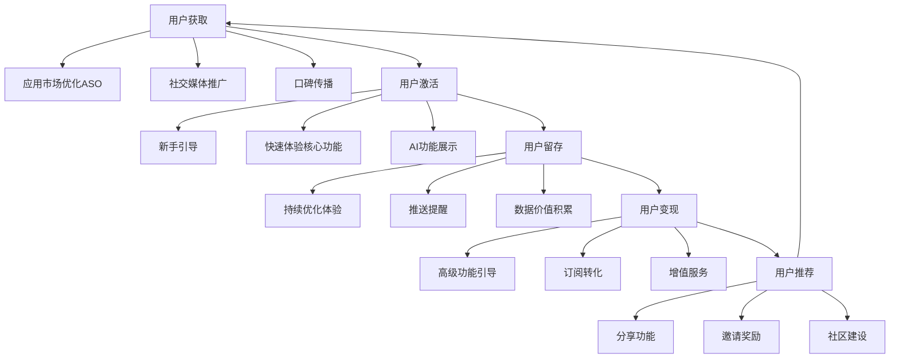


---

## 三、UI Flow 完整流程图

### 3.1 应用整体导航结构

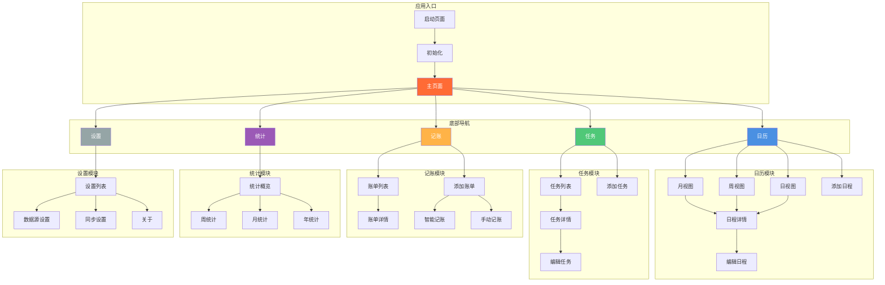


### 3.2 日历模块 UI Flow

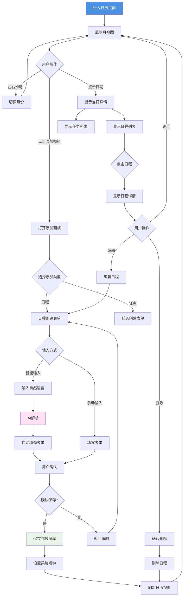

### 3.3 任务模块 UI Flow

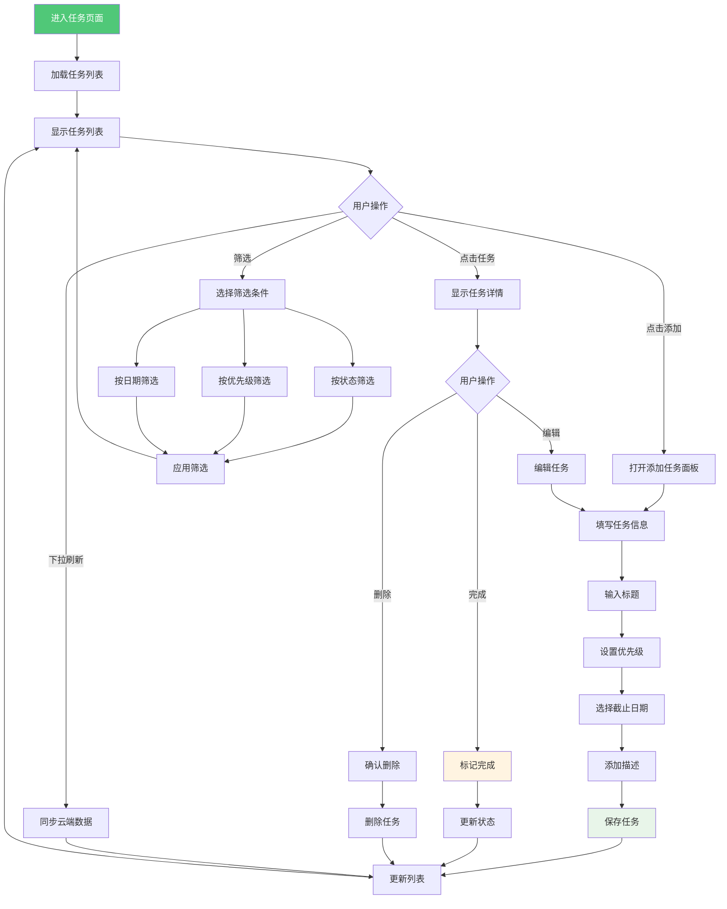


### 3.4 记账模块 UI Flow

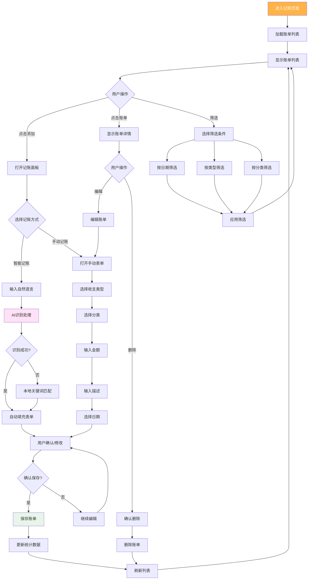

### 3.5 统计模块 UI Flow

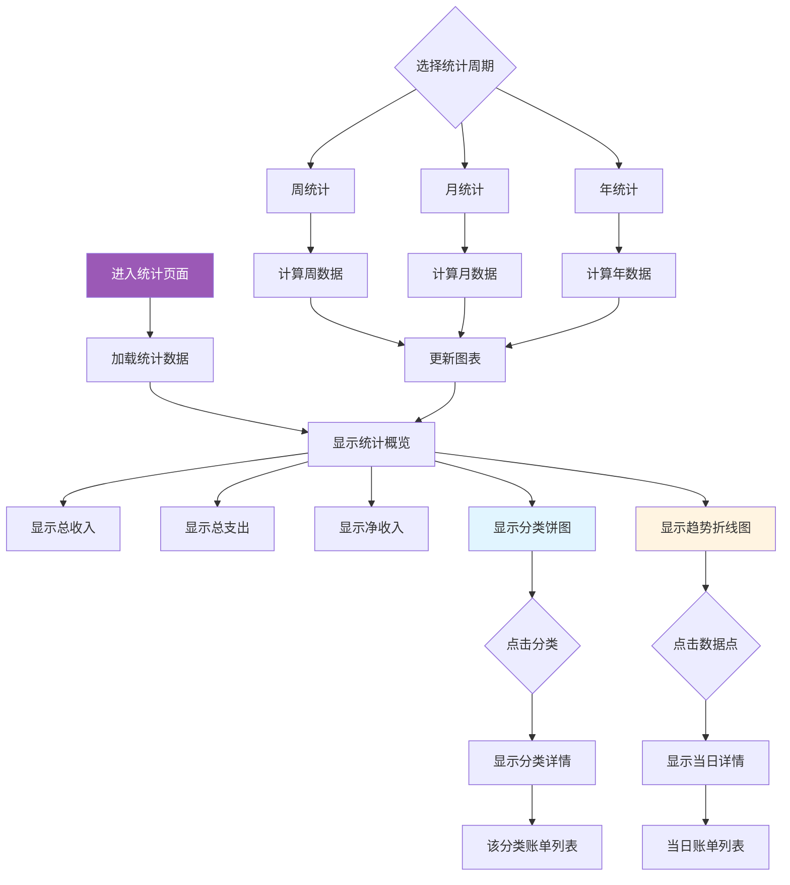


### 3.6 AI对话助手 UI Flow

```mermaid
flowchart TD
    A[进入AI对话页面] --> B[初始化对话]
    B --> C[并行加载用户数据]
    
    C --> C1[加载任务数据]
    C --> C2[加载日程数据]
    C --> C3[加载账单数据]
    
    C1 --> D[构建系统消息]
    C2 --> D
    C3 --> D
    
    D --> E[显示欢迎消息]
    E --> F[显示数据统计摘要]
    F --> G[等待用户输入]
    
    G --> H[用户输入问题]
    H --> I[发送到AI服务]
    I --> J[流式接收响应]
    J --> K[逐字显示回复]
    K --> L[完成显示]
    L --> M[添加到对话历史]
    M --> G
    
    N{AI回复类型} --> O[数据查询回答]
    N --> P[建议和分析]
    N --> Q[操作指导]
    
    O --> R[展示相关数据]
    P --> S[展示分析结果]
    Q --> T[展示操作步骤]
    
    style A fill:#ffe1f5
    style I fill:#fff4e1
    style K fill:#e1f5ff
```

### 3.7 数据同步 UI Flow

```mermaid
flowchart TD
    A[应用启动] --> B[初始化本地数据库]
    B --> C[检查网络状态]
    
    C --> D{网络可用?}
    D -->|是| E[初始化云端连接]
    D -->|否| F[仅使用本地数据]
    
    E --> G[查询待同步数据]
    G --> H{有待同步数据?}
    H -->|是| I[上传到云端]
    H -->|否| J[查询云端新数据]
    
    I --> K{上传成功?}
    K -->|是| L[更新同步状态]
    K -->|否| M[保持待同步状态]
    M --> N[记录错误日志]
    
    L --> J
    J --> O{有新数据?}
    O -->|是| P[下载云端数据]
    O -->|否| Q[同步完成]
    
    P --> R[合并到本地]
    R --> S[解决冲突]
    S --> T[更新本地数据]
    T --> Q
    
    Q --> U[更新UI显示]
    
    F --> V[监听网络变化]
    V --> W{网络恢复?}
    W -->|是| E
    W -->|否| V
    
    style A fill:#e1f5ff
    style I fill:#fff4e1
    style R fill:#e8f5e9
```


---

## 四、核心页面设计说明

### 4.1 主页面布局

```
┌─────────────────────────────────────┐
│           状态栏 (系统)              │
├─────────────────────────────────────┤
│                                     │
│                                     │
│           内容区域                   │
│      (根据Tab切换显示)               │
│                                     │
│                                     │
│                                     │
├─────────────────────────────────────┤
│  日历  │  任务  │  记账  │ 统计 │设置│
│   📅   │   ✓   │   💰   │  📊  │ ⚙️ │
└─────────────────────────────────────┘
```

### 4.2 交互设计要点

| 交互场景 | 设计方案 | 用户价值 |
|----------|----------|----------|
| 快速添加 | 底部浮动按钮，一键添加 | 减少操作步骤 |
| 智能输入 | 自然语言识别，自动填充 | 降低输入成本 |
| 手势操作 | 左右滑动切换月份/完成任务 | 操作更自然 |
| 即时反馈 | 操作后立即更新UI | 增强确定感 |
| 错误提示 | 友好的错误信息和重试选项 | 减少挫败感 |

### 4.3 视觉设计规范

| 设计元素 | 规范说明 |
|----------|----------|
| 主色调 | 橙色系 (#FF6B35)，活力、温暖 |
| 辅助色 | 蓝色 (#4A90E2)、绿色 (#50C878) |
| 字体 | HarmonyOS Sans，清晰易读 |
| 圆角 | 8-16px，柔和友好 |
| 间距 | 8px基础单位，保持一致性 |
| 阴影 | 轻微阴影，增加层次感 |

---

## 五、总结

辰序 (Chronos) 作为一款 HarmonyOS 原生时间管理应用，在设计过程中充分考虑了移动设计的八个关键要素：

1. **用户定位**：精准定位大学生和职场新人群体
2. **产品定位**：一站式智能时间管理工具
3. **需求定位**：满足日程、任务、记账的核心需求
4. **时机选择**：把握鸿蒙生态发展的黄金窗口期
5. **产品打磨**：持续迭代优化用户体验
6. **风险处置**：完善的容错和降级机制
7. **团队协作**：敏捷开发流程保证效率
8. **商业模式**：免费增值的可持续发展模式

通过完整的 UI Flow 设计，确保用户在使用过程中能够流畅地完成各项操作，AI 赋能的智能功能进一步提升了使用效率，离线优先的架构保证了应用的可靠性。

---

**文档版本**：v1.0  
**最后更新**：2025年1月  
**作者**：辰序开发团队
